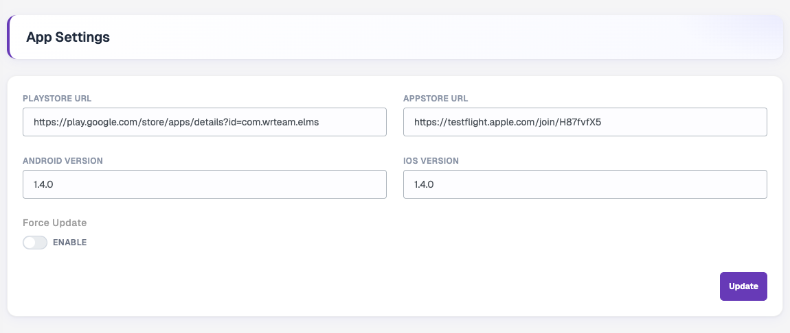

# App Settings

Go to **Settings → App**. These settings are used by your Flutter app.

| Field | Description |
| --- | --- |
| **Playstore URL** | Link to your app on Google Play. |
| **Appstore URL** | Link to your app on the Apple App Store. |
| **Android Version** | Latest Android app version, for example `1.4.0`. |
| **iOS Version** | Latest iOS app version, for example `1.4.0`. |
| **Force Update** | When enabled, users on an older version must update before they can keep using the app. |

Click **Update** to save.
