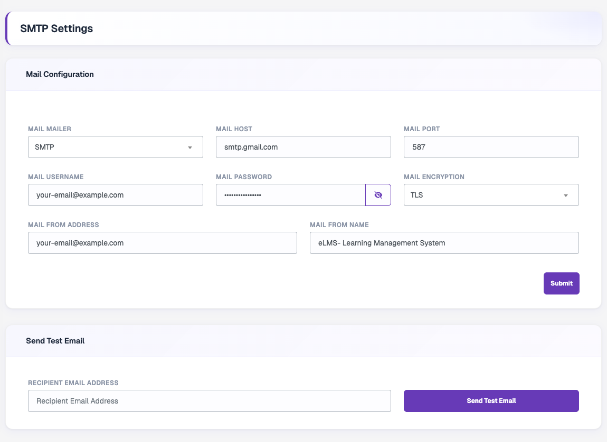

# Email Configuration

Go to **Settings → Email Configuration** to set up the mail server used for system emails such as password resets and notifications.

## Mail Configuration

| Field | Description |
| --- | --- |
| **Mail Mailer** | Mail driver: *SMTP*, *Send Mail*, *Mailgun* or *Postmark*. |
| **Mail Host** | Your mail server host, for example `smtp.gmail.com`. |
| **Mail Port** | SMTP port, for example `587` for TLS. |
| **Mail Username** | Username of your mail account. |
| **Mail Password** | Password or app password of your mail account. Use the eye icon to show or hide it. |
| **Mail Encryption** | *TLS* or *SSL*. |
| **Mail From Address** | Email address emails are sent from. |
| **Mail From Name** | Sender name users see, for example your platform name. |

Click **Submit** to save.

:::tip
If you use Gmail, create an **App Password** in your Google account and use it as the mail password instead of your normal password.
:::

## Send Test Email

After saving, enter a **Recipient Email Address** and click **Send Test Email** to confirm the settings work. If sending fails, an **SMTP Debug Log** is shown to help you find the problem.
