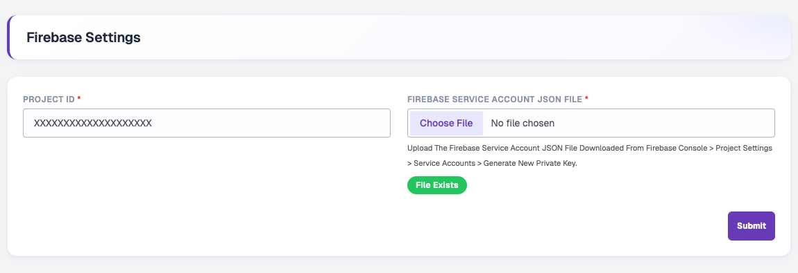
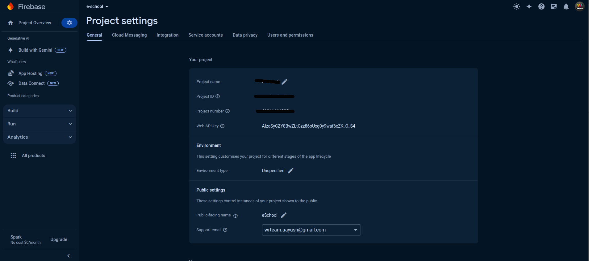
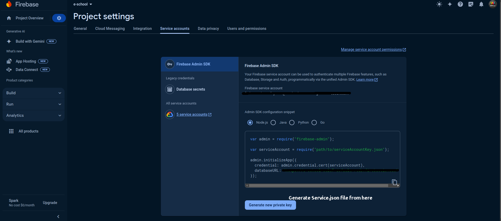

# Firebase Settings

These settings will be used by your Flutter APP / Next JS web.

Go to **Settings → Firebase**. Enter your **Project ID** and upload the **Firebase Service Account JSON File**. When a file has already been uploaded, a green **File Exists** badge is shown. Click **Submit** to save.

## Firebase Project Id

1. In the Firebase console, go to Project Settings
2. Go to > General where Project Id is given add that to Admin Panel in Settings > Firebase Setting.

## Service Json File

1. In the Firebase console, open Settings > Service Accounts.
2. Click Generate New Private Key, then confirm by clicking Generate Key.
3. Securely store the JSON file containing the key and upload in Admin Panel in  Settings > Firebase Setting. 
