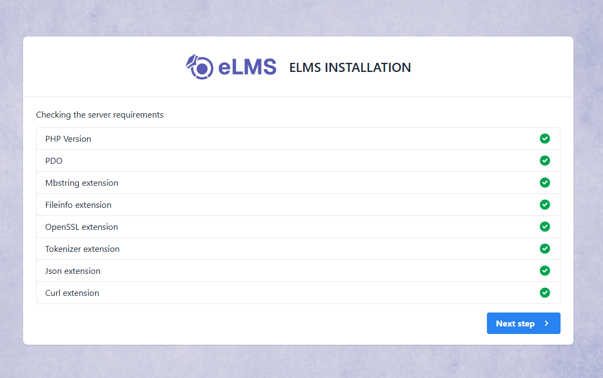
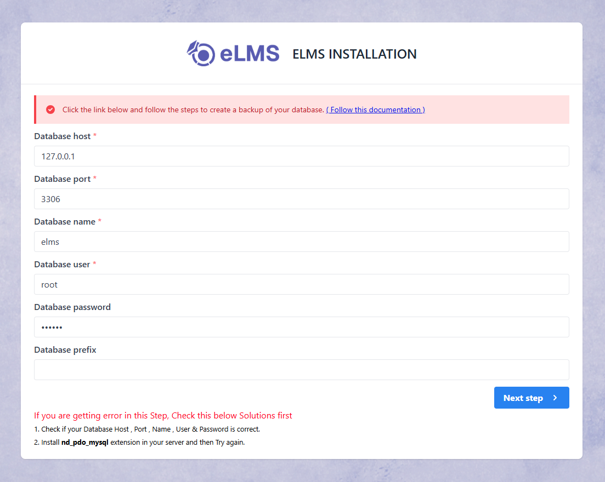
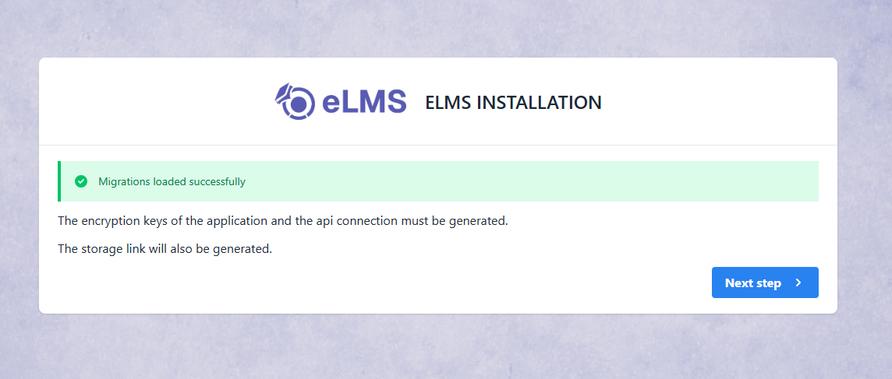
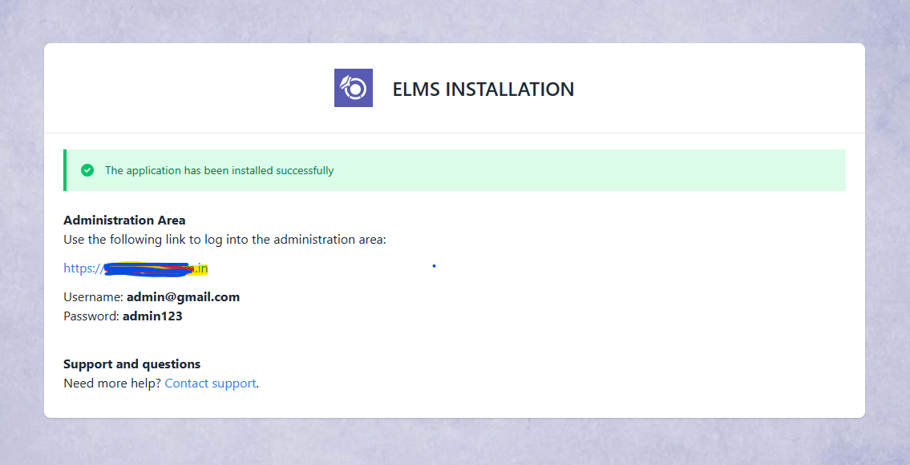

# Installation Steps

## 1. Installation Screen

## 2. Server Requirements & Extensions

If PHP version is lower than 8.3 or any extension is not installed then it will be highlighted using Red color. So you need to make sure that your server meets all requirements.

## 3. Permission Screen

Make sure this folder have read & write permissions. If not then assign this folders read & write permissions.

## 4. Purchase Code Validation

Here you'll have to insert the purchase code obtained from CodeCanyon to authenticate your purchase and authorize your server to access the services.

To find your Purchase code you can visit this link: [Where is My Purchase code?](https://help.market.envato.com/hc/en-us/articles/202822600-Where-Is-My-Purchase-Code-)

## 5. Database Configuration Screen

## 6. Database Connection Status

 

## 7. Final Installation Screen

If everything is configured successfully then your Admin panel has been installed successfully. You can login as Super Admin using the credentials provided here.

 