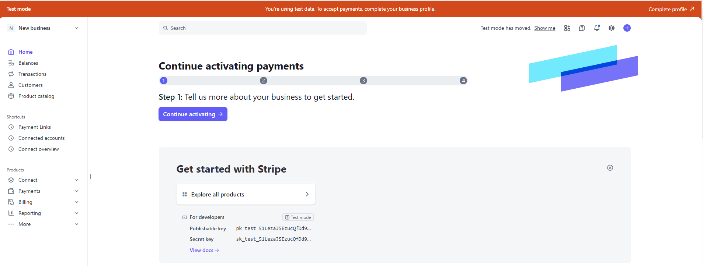
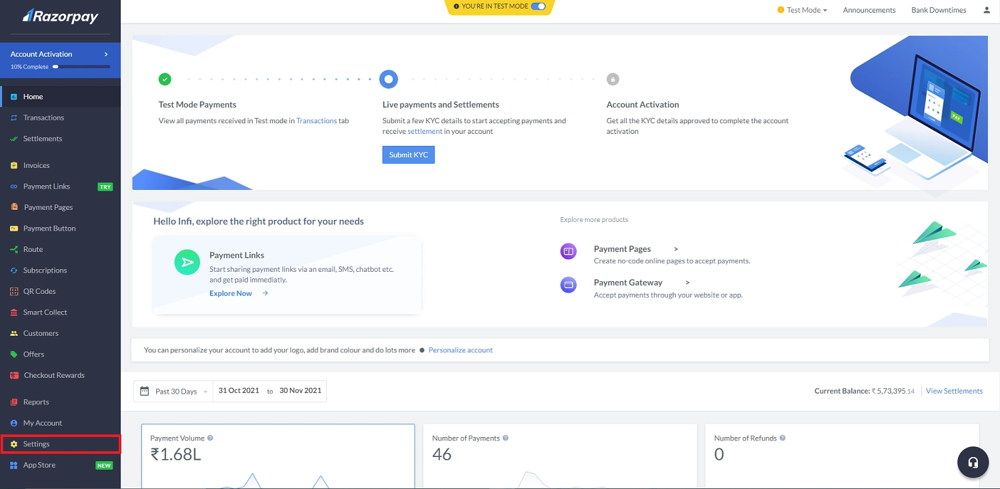

# Payment Gateway Settings

## Stripe
1. Log in to the Stripe dashboard — https://dashboard.stripe.com/
2. You will find your Publishable key and Secret key in the dashboard.

3. Docs - https://docs.stripe.com/payments?payments=popular

## Razorpay

1. Go to https://dashboard.razorpay.com/ and sign in with your Razorpay account

2. Click Settings

3. Click Api keys

4. Genetare new key or regenerate key and copy it.   

## Flutterwave

1. Log in to the Flutterwave dashboard — https://app.flutterwave.com/login
2. In Settings → Developers → API Keys, you can find your keys.

3. Docs - https://developer.flutterwave.com/docs/getting-started?_gl=1*1xkvvzx*_gcl_au*MTQxNjg3NzkzOC4xNzY0MjU2Nzg1*_ga*MTg3MTEwMDMzNy4xNzY0MjMwNzI5*_ga_KQ9NSEMFCF*czE3NjQyNTY3NDgkbzEkZzEkdDE3NjQyNTY3ODUkajIzJGwwJGgw 