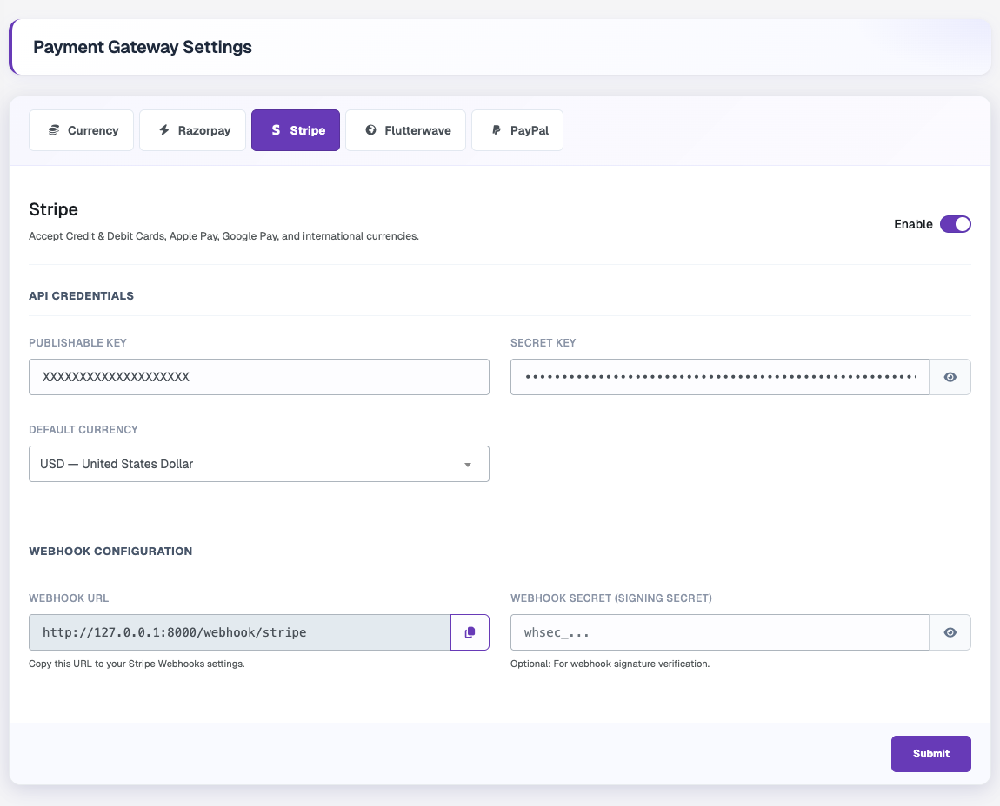
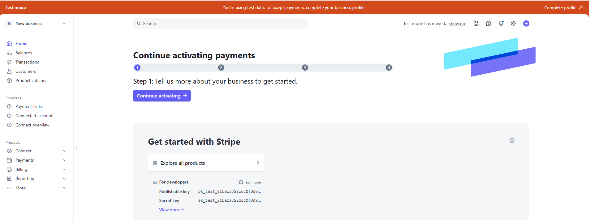
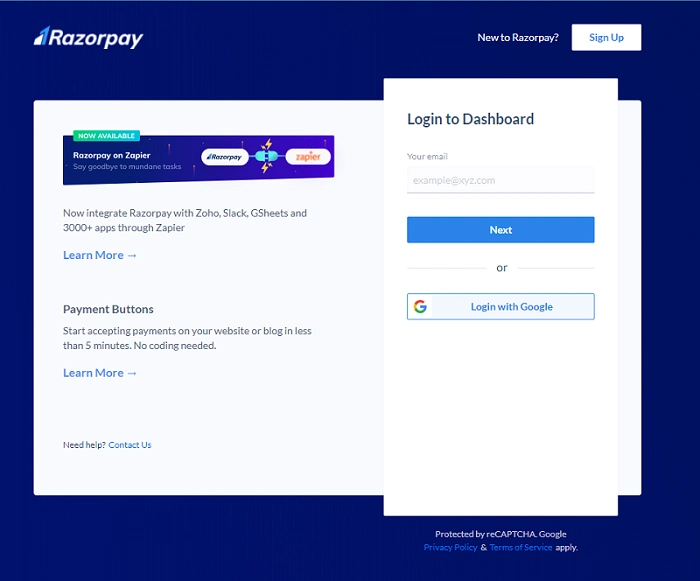
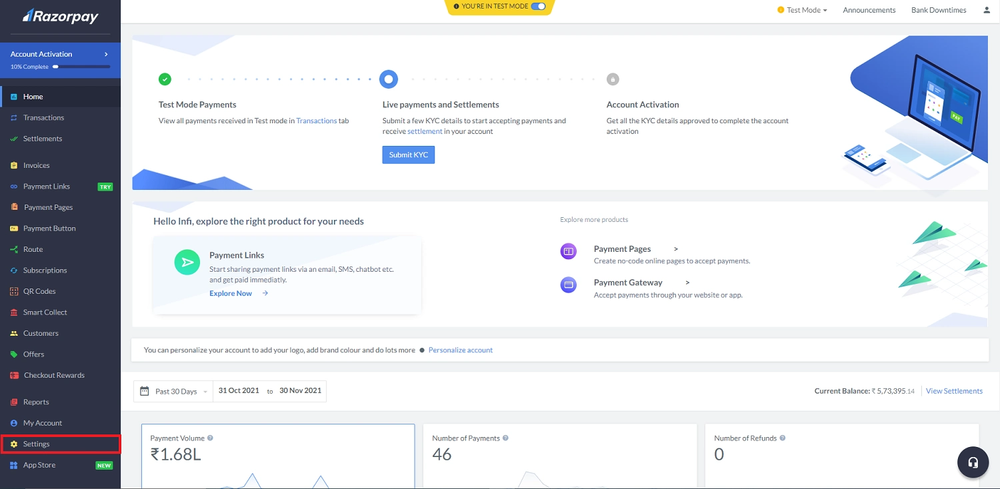
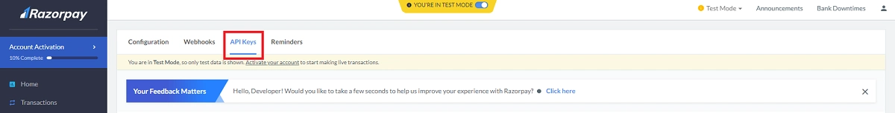
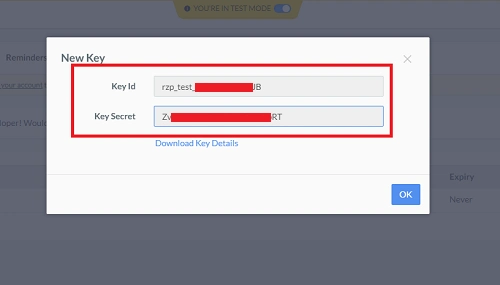
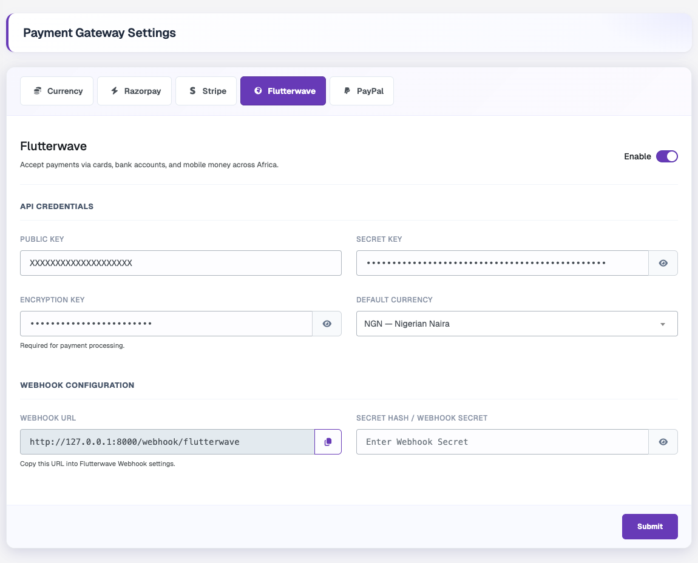
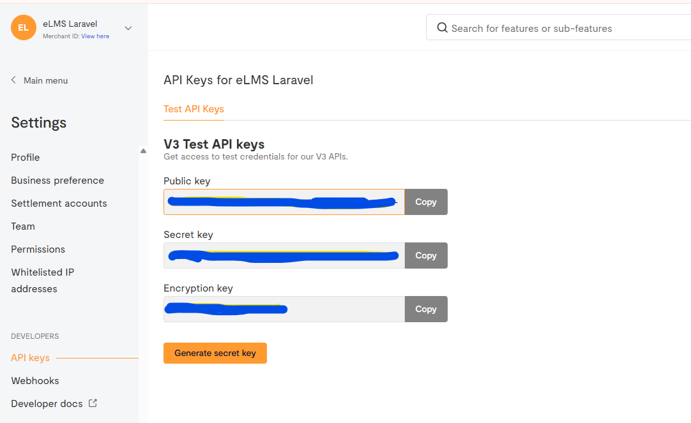
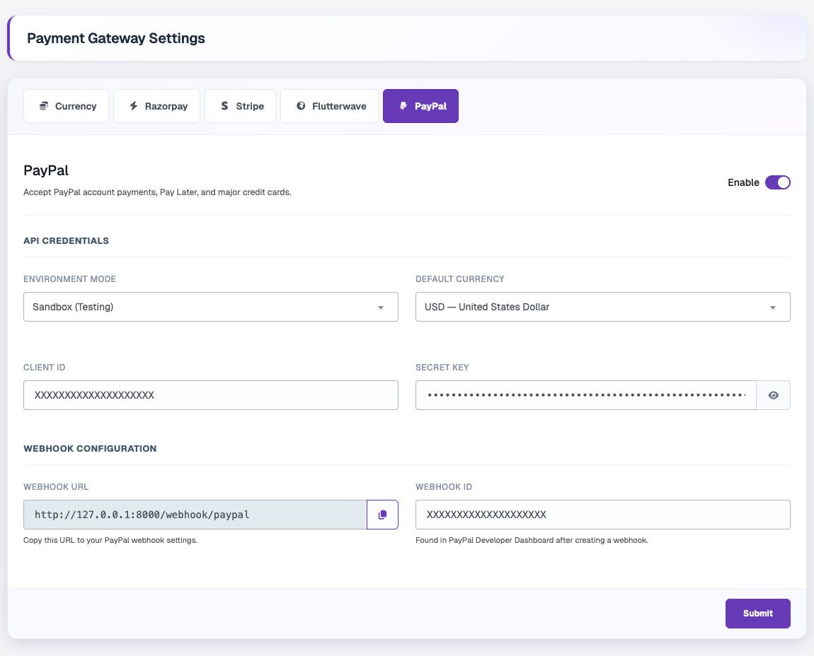

# Payment Gateway Settings

Go to **Settings → Payment Gateway**. Each payment option has its own tab: **Currency**, **Razorpay**, **Stripe**, **Flutterwave** and **PayPal**. Each tab has its own **Submit** button, and a gateway only appears to users when its **Enable** toggle is on.

## Currency

Set the system-wide currency code and display symbol used across the platform.

## Stripe

Enter the **Publishable Key**, **Secret Key** and **Default Currency**. Copy the **Webhook URL** into your Stripe Webhooks settings and paste the signing secret (`whsec_...`) into **Webhook Secret**. The webhook secret is optional but recommended for signature verification.

How to get the keys:
1. Log in to the Stripe dashboard — https://dashboard.stripe.com/
2. You will find your Publishable key and Secret key in the dashboard.

3. Docs - https://docs.stripe.com/payments?payments=popular

## Razorpay

Enter the **API Key** and **Secret Key**. Copy the **Webhook URL** into your Razorpay webhook settings and add the same **Webhook Secret Key** on both sides.

How to get the keys:

1. Go to https://dashboard.razorpay.com/ and sign in with your Razorpay account

2. Click Settings

3. Click Api keys

4. Genetare new key or regenerate key and copy it.   

## Flutterwave

Enter the **Public Key**, **Secret Key**, **Encryption Key** and **Default Currency**. Copy the **Webhook URL** into your Flutterwave webhook settings and use the same value as **Secret Hash / Webhook Secret**.

How to get the keys:

1. Log in to the Flutterwave dashboard — https://app.flutterwave.com/login
2. In Settings → Developers → API Keys, you can find your keys.

3. Docs - https://developer.flutterwave.com/docs/getting-started?_gl=1*1xkvvzx*_gcl_au*MTQxNjg3NzkzOC4xNzY0MjU2Nzg1*_ga*MTg3MTEwMDMzNy4xNzY0MjMwNzI5*_ga_KQ9NSEMFCF*czE3NjQyNTY3NDgkbzEkZzEkdDE3NjQyNTY3ODUkajIzJGwwJGgw

## PayPal

1. Log in to the PayPal Developer Dashboard — https://developer.paypal.com/dashboard/
2. Go to **Apps & Credentials**, choose **Sandbox** (testing) or **Live**, and create or open an app.
3. Copy the **Client ID** and **Secret Key** into the PayPal tab, and set **Environment Mode** to match (Sandbox or Live).
4. Create a webhook in the dashboard using the **Webhook URL** shown in the panel, then paste the generated **Webhook ID**.
5. Choose the **Default Currency** and click **Submit**.
