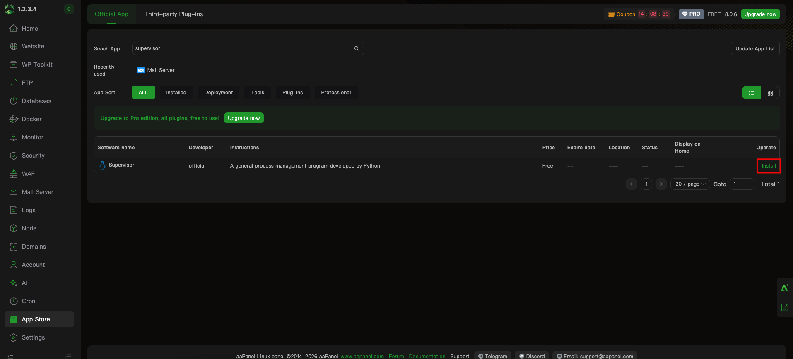
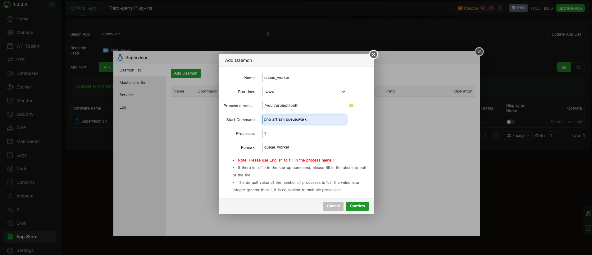
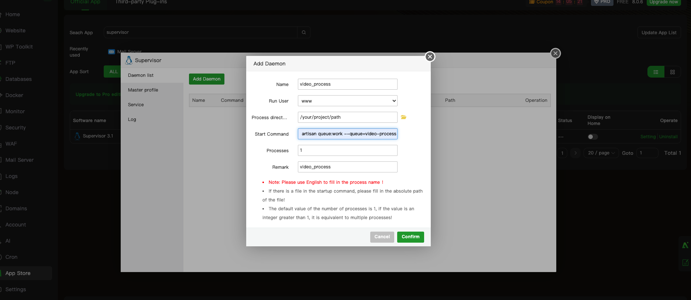
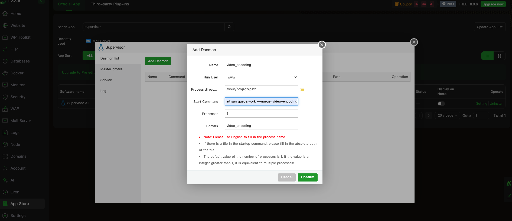

# Queue Setup (Supervisor)

eLMS runs slow tasks in the background so the website stays fast. Background tasks are handled by **queue workers**, and **Supervisor** is the tool that keeps those workers running all the time (and restarts them if they stop).

:::info Do I need this?
Yes, if you want video uploads, HLS video encoding, notifications and emails to work properly on a live server. Without workers, these tasks are added to the queue but never run.
:::

This guide is for a **VPS / dedicated server** where you have SSH (terminal) access with `sudo`. For shared hosting, see [No SSH access?](#no-ssh-access).

## What runs in the background

eLMS uses **3 queues**. Each queue needs its own worker.

| Queue | What it does | When it is used | Workers | Timeout |
|---|---|---|---|---|
| `default` | Emails, push notifications, order notifications, file migration between storage drivers | Whenever the system sends a notification | 2 | 1 hour |
| `video-process` | Moves an uploaded video to its final storage (Local / S3 / R2) | After a lecture video is uploaded in chunks | 1 | 2 hours |
| `video-encoding` | Converts videos to HLS (CPU heavy) | After a video is stored, if HLS auto encode is on | 1 | 2 hours |

Why three queues? A large video upload or encoding job can take a long time. Separate queues make sure it never blocks notifications and other quick jobs.

:::warning
If the `video-process` worker is not running, uploaded videos stay in the temporary folder and the lecture video is not updated. If `video-encoding` is not running, HLS videos stay in "pending".
:::

## Before you start

Make sure you have:

- A VPS with Ubuntu / Debian / CentOS and SSH access with `sudo`
- eLMS already installed and working (see [Installation Steps](./installation-steps.md))
- PHP 8.3+ available on the command line (check with `php -v`)
- **FFmpeg** installed if you use HLS video encoding (check with `ffmpeg -version`)
- The path of your project, for example `/var/www/html`. Use `pwd` inside your project folder to see it.

## Step 1: Set the queue connection

Open the `.env` file in your project and set:

```env
QUEUE_CONNECTION=database
```

Then clear the config cache:

```bash
cd /var/www/html
php artisan config:clear
```

:::caution
If `QUEUE_CONNECTION=sync`, jobs run immediately inside the web request instead of the background. This is fine for local testing, but on a live server large uploads will time out. Use `database` for production.
:::

## Step 2: Choose your setup method

| Method | Best for | Steps |
|---|---|---|
| **Option A: aaPanel** (easiest) | Servers managed with aaPanel / BT Panel | Follow [Step 3A](#step-3a-set-up-workers-with-aapanel-easy-method) |
| **Option B: Manual** | Any VPS with SSH access | Follow [Step 3B](#step-3b-set-up-workers-manually-ssh) |

After finishing Step 3A or 3B, continue with [Step 4](#step-4-check-that-everything-is-running).

## Step 3A: Set up workers with aaPanel (easy method)

If your server uses aaPanel, you can install and manage Supervisor from the panel without typing commands or editing config files.

### 1. Install Supervisor from the App Store
1. Log in to aaPanel and open **App Store**.
2. Search for **Supervisor** in the search box.
3. Click **Install** in the **Operate** column and wait for the installation to finish.



### 2. Add the 3 workers
After installation, click **Setting** next to Supervisor in the App Store. In the **Daemon list** tab, click **Add Daemon** and create the three workers below one by one, clicking **Confirm** after each.

| Field | Worker 1 | Worker 2 | Worker 3 |
|---|---|---|---|
| **Name** | `queue_worker` | `video_process` | `video_encoding` |
| **Run User** | `www` | `www` | `www` |
| **Process directory** | Your project path | Your project path | Your project path |
| **Start Command** | `php artisan queue:work` | `php artisan queue:work --queue=video-process` | `php artisan queue:work --queue=video-encoding` |
| **Processes** | `2` | `1` | `1` |
| **Remark** | `queue_worker` | `video_process` | `video_encoding` |

:::tip
- **Process directory** is the folder of your eLMS project, for example `/www/wwwroot/your-site`. Use the folder icon to select it.
- The commands are kept simple on purpose. The video jobs already define their own 2-hour timeout in the code, so no extra options are needed.
- Use English letters, numbers and underscores in **Name**. aaPanel does not accept other characters.
- If `php` is not found, use the full PHP path, for example `/www/server/php/83/bin/php artisan queue:work ...` (`83` is PHP 8.3).
:::

**Worker 1 – Default queue** (notifications, emails)



**Worker 2 – Video process queue** (chunked video upload)



**Worker 3 – Video encoding queue** (HLS encoding)



### 3. Check that they are running
In the **Daemon list**, all three workers should show the status **Running**. Use the **Log** tab to see the output of the workers, and restart a worker from its **Operation** column after you update eLMS.

That's it. Skip Step 3B and continue with [Step 4](#step-4-check-that-everything-is-running) to test.

## Step 3B: Set up workers manually (SSH)

Use this method if you are not using aaPanel.

### 1. Install Supervisor

```bash
# Ubuntu / Debian
sudo apt-get update
sudo apt-get install supervisor

# CentOS / RHEL
sudo yum install epel-release
sudo yum install supervisor
```

Start it and make sure it starts after a server reboot:

```bash
sudo systemctl enable supervisor
sudo systemctl start supervisor
```

### 2. Find where your config file goes

:::note
Using aaPanel? Use [Step 3A](#step-3a-set-up-workers-with-aapanel-easy-method) instead; it is much easier.
:::

Supervisor only reads config files from one specific folder. On a plain server this is usually `/etc/supervisor/conf.d/`, but **hosting panels (aaPanel / BT Panel, cPanel, Plesk) use a different folder and extension**, so check first.

Run:

```bash
sudo grep -A5 "\[include\]" /etc/supervisor/supervisord.conf
```

Look at the `files =` line:

| Output | Put your file in | File name must end with |
|---|---|---|
| `files = /etc/supervisor/conf.d/*.conf` | `/etc/supervisor/conf.d/` | `.conf` |
| `files = /etc/supervisor/conf.d/*.ini` | `/etc/supervisor/conf.d/` | `.ini` |

### 3. Create the worker config files

Create **three separate files**, one for each worker. Use `.ini` instead of `.conf` if step 2 told you to, and create them in the folder you found in step 2. In each file, paste the content shown under its command, then save (`Ctrl + O`, `Enter`, `Ctrl + X`).

#### Worker 1: General queue (notifications, emails)

```bash
sudo nano /etc/supervisor/conf.d/queue_worker.conf
```

```ini
[program:queue_worker]
process_name=%(program_name)s_%(process_num)02d
command=php /var/www/html/artisan queue:work
autostart=true
autorestart=true
stopasgroup=true
killasgroup=true
user=www-data
numprocs=2
redirect_stderr=true
stdout_logfile=/var/www/html/storage/logs/queue_worker.log
```

#### Worker 2: Video process queue (chunked video upload)

```bash
sudo nano /etc/supervisor/conf.d/video_process.conf
```

```ini
[program:video_process]
process_name=%(program_name)s_%(process_num)02d
command=php /var/www/html/artisan queue:work --queue=video-process
autostart=true
autorestart=true
stopasgroup=true
killasgroup=true
user=www-data
numprocs=1
redirect_stderr=true
stdout_logfile=/var/www/html/storage/logs/video_process.log
```

#### Worker 3: Video encoding queue (HLS, CPU heavy)

```bash
sudo nano /etc/supervisor/conf.d/video_encoding.conf
```

```ini
[program:video_encoding]
process_name=%(program_name)s_%(process_num)02d
command=php /var/www/html/artisan queue:work --queue=video-encoding
autostart=true
autorestart=true
stopasgroup=true
killasgroup=true
user=www-data
numprocs=1
redirect_stderr=true
stdout_logfile=/var/www/html/storage/logs/video_encoding.log
```

Change these values in **all three files** for your server:

| Setting | What to change |
|---|---|
| `/var/www/html` | The real path of your eLMS project (appears in `command` and `stdout_logfile`). |
| `user` | The user that owns your project files. Usually `www-data` (Apache/Nginx on Ubuntu), `nginx`, `apache`, or `www` (aaPanel). Check with `ls -l /var/www/html`. |
| `php` | Use the full path if needed, for example `/usr/bin/php` or `/usr/local/bin/php8.3` (find it with `which php`). |
| `numprocs` | Number of workers for that queue. Keep video queues at `1`. |

:::note
Timeouts are managed by the application code (the video jobs allow up to 2 hours), so no timeout options are needed in the command.
:::

### 4. Load the config

```bash
sudo supervisorctl reread
sudo supervisorctl update
sudo supervisorctl start all
```

## Step 4: Check that everything is running

```bash
sudo supervisorctl status
```

You should see all workers as `RUNNING`:

```
queue_worker:queue_worker_00            RUNNING   pid 1201, uptime 0:00:12
queue_worker:queue_worker_01            RUNNING   pid 1202, uptime 0:00:12
video_process:video_process_00   RUNNING   pid 1203, uptime 0:00:12
video_encoding:video_encoding_00 RUNNING   pid 1204, uptime 0:00:12
```

To test, upload a lecture video from the admin panel. Then watch the worker log:

```bash
tail -f /var/www/html/storage/logs/video_process.log
```

## Step 5: Add the cron job

Queue workers are **not** the same as scheduled tasks. eLMS also needs one cron job for things like releasing instructor commissions, live class reminders and cleaning old upload chunks. You can copy the exact command from **Settings → System → Refund → Cron Job Command**. It looks like this:

```bash
* * * * * cd /var/www/html && php artisan schedule:run >> /dev/null 2>&1
```

Add it with `crontab -e` (or in your hosting panel's Cron section) and set it to run every minute.

## After you update eLMS

Workers keep the old code in memory. After every update or file change, restart them so they use the new code:

```bash
cd /var/www/html
php artisan queue:restart
```

Supervisor starts the workers again automatically. You can also run `sudo supervisorctl restart all`.

## Useful commands

```bash
# See the status of all workers
sudo supervisorctl status

# Start / stop / restart all workers
sudo supervisorctl start all
sudo supervisorctl stop all
sudo supervisorctl restart all

# Restart only one queue
sudo supervisorctl restart video_process:*

# After editing the config file
sudo supervisorctl reread
sudo supervisorctl update

# See failed jobs and retry them
php artisan queue:failed
php artisan queue:retry all
```

## No SSH access?

Shared hosting usually does not allow Supervisor. In that case:

- Use your hosting panel's **Cron Jobs** section and add the scheduler cron from above.
- Ask your hosting provider whether they support persistent queue workers.
- For video uploads and HLS encoding, we recommend a VPS, because these tasks run for a long time and need a worker that is always running.

## Troubleshooting

### Workers are not listed in `supervisorctl status`
- The config file is in the wrong folder or has the wrong extension. Repeat [Step 3B, part 2](#2-find-where-your-config-file-goes).
- You did not run `sudo supervisorctl reread` and `sudo supervisorctl update`.
- Run `sudo supervisorctl avail` to see whether Supervisor can see the config.

### Worker status is `FATAL` or keeps restarting
- Check the log file path from the config. Open it: `tail -50 /var/www/html/storage/logs/queue_worker.log`
- The `php` path or the project path in `command` is wrong. Run the command manually to see the error:
  `php /var/www/html/artisan queue:work`
- The `user` has no permission on the project. Check that the `storage` folder is writable by that user.

### Permission denied
- Make sure `user` matches the owner of your project files.
- Check the Supervisor log: `sudo tail -50 /var/log/supervisor/supervisord.log`

### Notifications or emails are not being sent
- Check that `QUEUE_CONNECTION=database` in `.env` and that `queue_worker` is `RUNNING`.
- Check the mail settings in **Settings → Email Configuration**.

### Uploaded video is not showing or stays pending
- Make sure `video_process` is `RUNNING`.
- Check `video_process.log` and `storage/logs/laravel.log` for `ProcessVideoUploadJob` errors.
- If you use S3 or R2, test the connection in **Settings → System → Storage**.

### HLS video encoding is failing or stays pending
- Make sure `video_encoding` is `RUNNING`.
- Check FFmpeg: `ffmpeg -version`
- Check `video_encoding.log`.
- Check `storage/logs/laravel.log` for the exact error of the failed job.

### Changes in code or settings are not picked up
- Run `php artisan queue:restart` so the workers reload.
