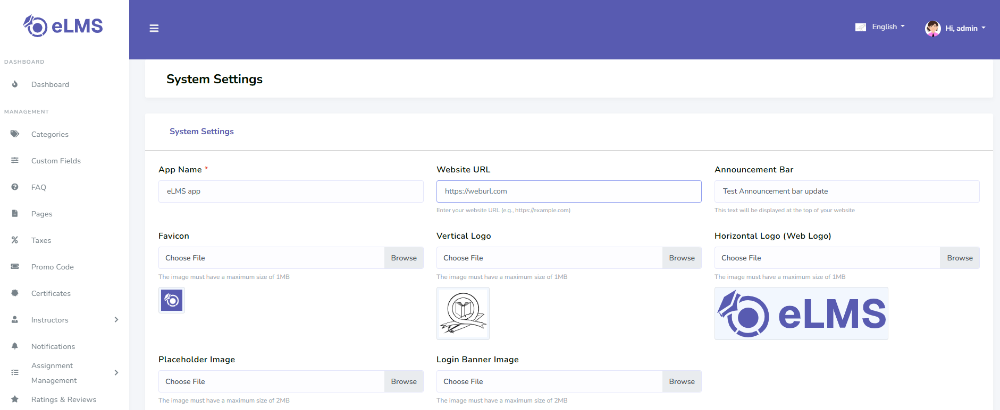
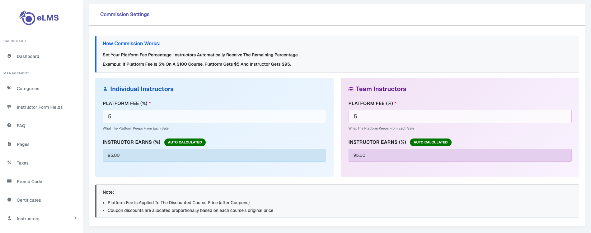
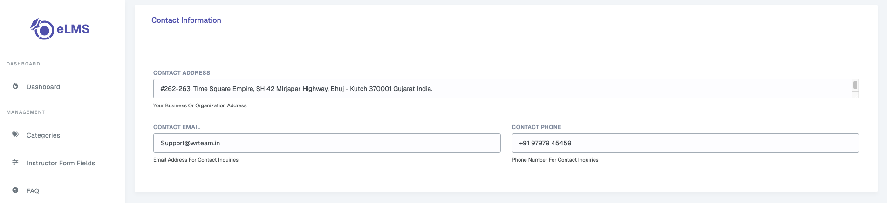
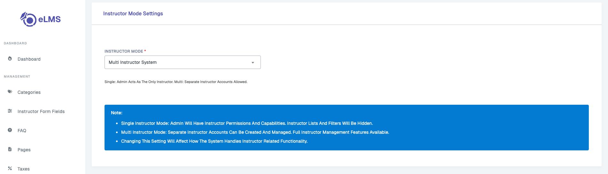
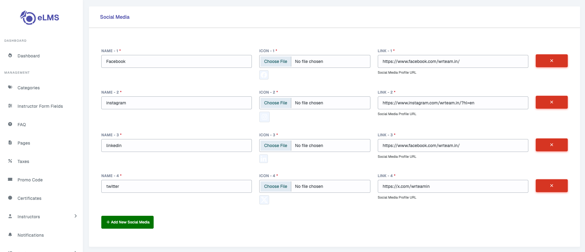
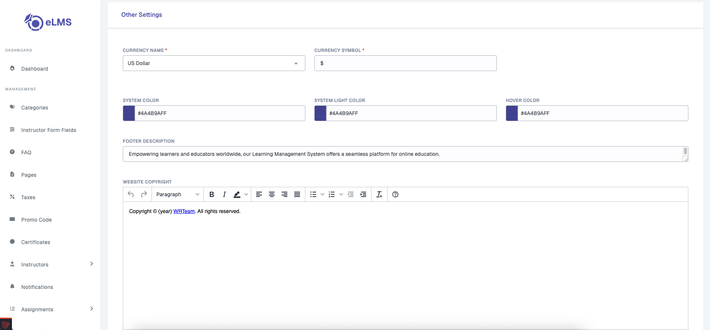
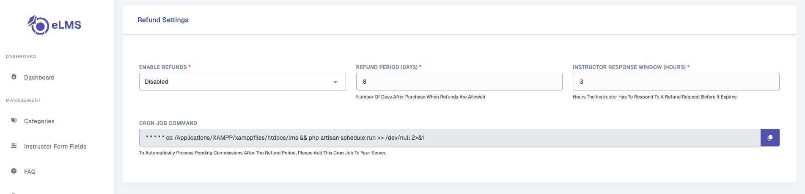

# System Settings

Set your System Settings here.

### Commission Settings
Manage the commission rates for instructors and the platform.
Define how revenue is shared between the system and its instructors for course sales.

### Contact Info
Update the primary contact details for your platform, including email, phone number, and address.
These details are typically displayed on the frontend for users to reach out.

### Instructor Mode Settings
Configure the behavior and permissions for instructors on the platform.
Toggle features like auto-approval of courses or instructor registration.

### Social Links
Add and update links to your platform's social media profiles such as Facebook, Twitter, and LinkedIn.
These links help in building a social presence and connecting with your audience.

### Other Settings
Configure miscellaneous system settings including app name, logo, and other general preferences.
These settings control various small but important aspects of the platform's appearance and behavior.

### Refund Settings
Manage the refund policy and settings for your courses and transactions.
Set rules for refund windows and conditions that apply when users request a refund.

