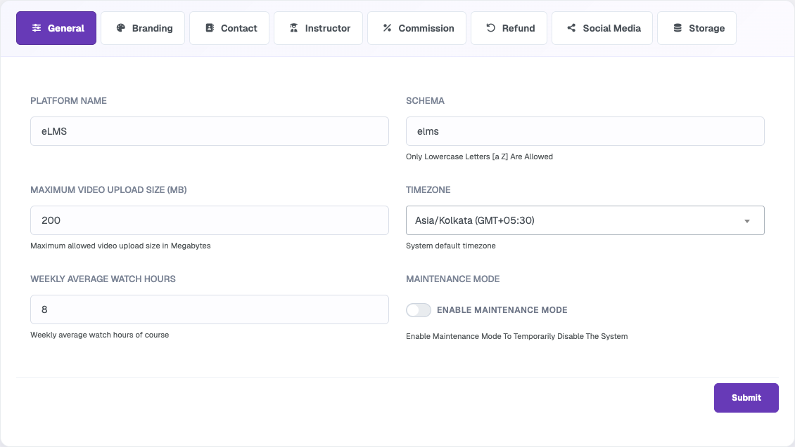
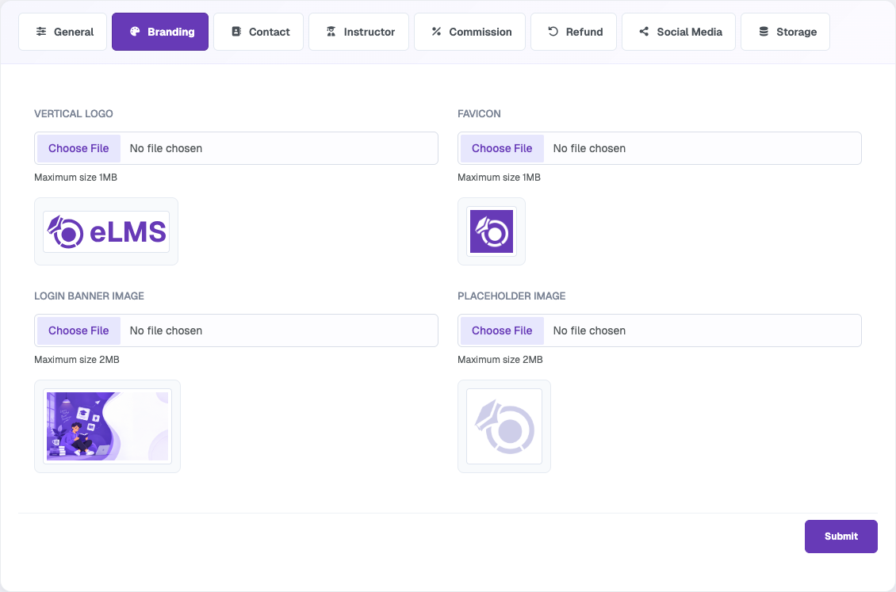
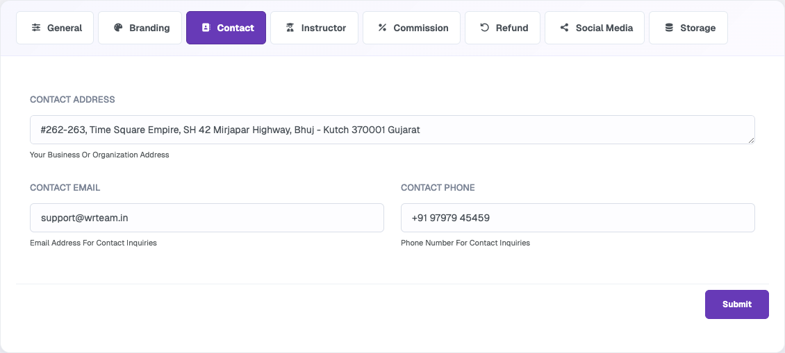
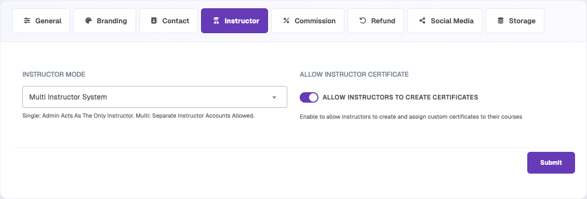
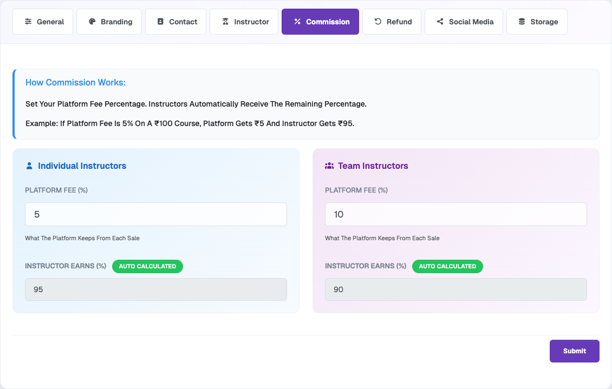
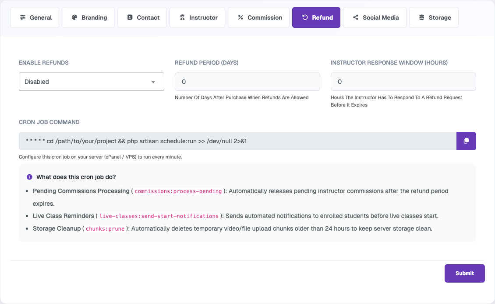
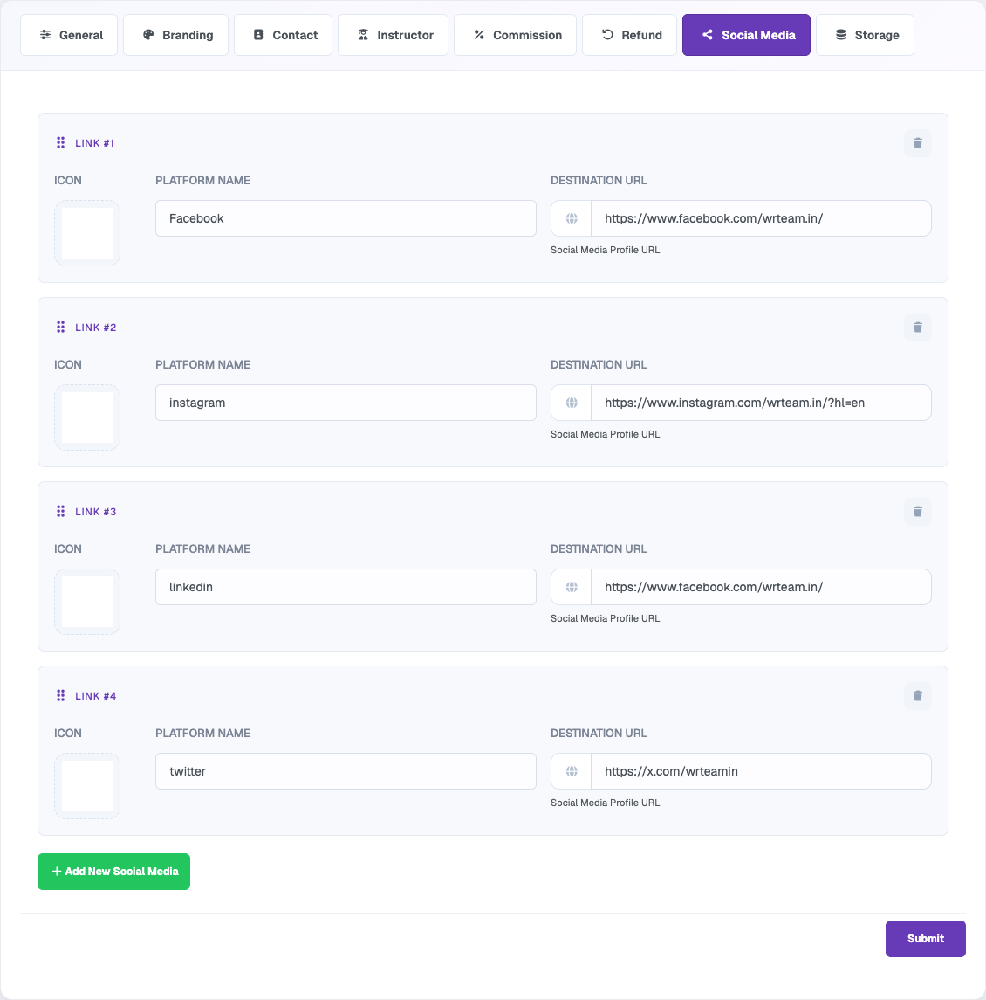
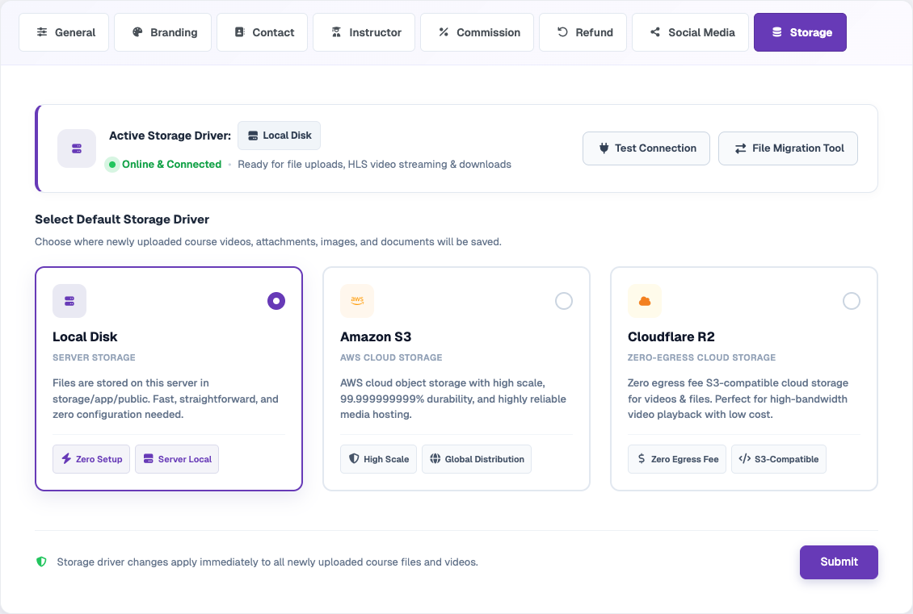

# System Settings

Go to **Settings → System**. System Settings is split into tabs, each with its own **Submit** button. Changes in one tab are saved only when you submit that tab.

### General
Basic platform configuration.

- **Platform Name** – name of your platform.
- **Schema** – lowercase letters (a–z) only.
- **Maximum Video Upload Size (MB)** – largest video file that can be uploaded.
- **Timezone** – default timezone for dates and times across the system.
- **Weekly Average Watch Hours** – weekly average watch hours of a course.
- **Maintenance Mode** – temporarily disables the system for visitors while you make changes.

### Branding
Upload the images used to brand your platform.

- **Vertical Logo** (max 1MB)
- **Favicon** (max 1MB)
- **Login Banner Image** (max 2MB) – shown on the login page.
- **Placeholder Image** (max 2MB) – shown where an image is missing.

:::note
The website logo is now set in [Web Settings](./web-settings.md), and colors in [Theme Settings](./theme-settings.md).
:::

### Contact
Business address, email and phone number displayed to users on the frontend.

### Instructor
Controls how instructors work on the platform.

- **Instructor Mode** – *Single Instructor* (admin acts as the only instructor) or *Multi Instructor System* (separate instructor accounts are allowed).
- **Allow Instructor Certificate** – lets instructors create and assign custom certificates to their courses.

### Commission
Set how revenue is shared. Enter the **Platform Fee (%)** and the instructor share is calculated automatically (100 − platform fee). Separate rates can be set for **Individual Instructors** and **Team Instructors**.

### Refund
Set the refund rules for course purchases.

- **Enable Refunds** – turn refunds on or off.
- **Refund Period (Days)** – days after purchase in which a refund can be requested.
- **Instructor Response Window (Hours)** – time the instructor has to respond before the request expires.
- **Cron Job Command** – add this command to your server's cron (cPanel / VPS) to run **every minute**. It processes pending commissions after the refund period, sends live class reminders, and removes temporary upload chunks older than 24 hours.

### Social Media
Add links to your social profiles. Each link has an icon, platform name and destination URL. Use **Add New Social Media** to add more links.

### Storage
Choose where newly uploaded videos, attachments, images and documents are saved.

- **Local Disk** – files stay on your server. No setup needed.
- **Amazon S3** – AWS cloud object storage.
- **Cloudflare R2** – S3-compatible storage with zero egress fees.

The status card at the top shows the active driver. Use **Test Connection** to confirm it is working, and **File Migration Tool** to move existing files to another driver. The new driver applies to newly uploaded files.
