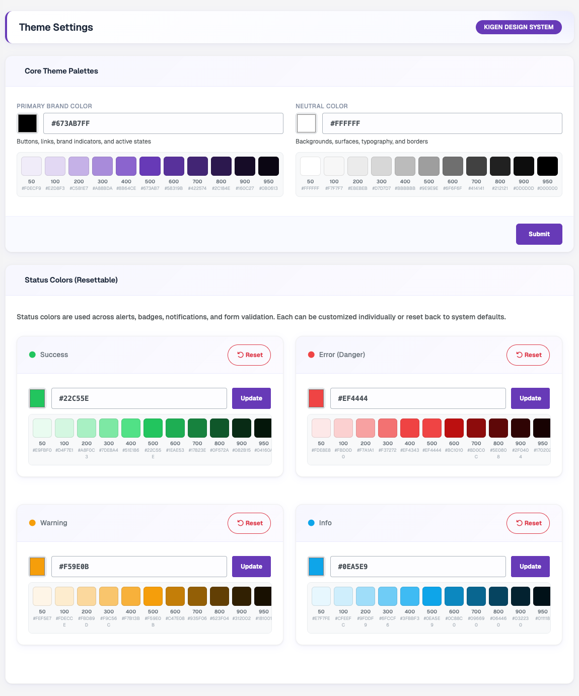

# Theme Settings

Go to **Settings → Theme Settings** to change the colors used across the admin panel, web and Flutter app. Colors are defined as palettes (shades 50–950), so one base color is enough to generate the full set.

### Core Theme Palettes
- **Primary Brand Color** – used for buttons, links, brand indicators and active states.
- **Neutral Color** – used for backgrounds, surfaces, typography and borders.

Enter a hex code or pick a color, check the generated shade preview, then click **Submit** to save.

### Status Colors
Status colors are used for alerts, badges, notifications and form validation. Each one can be updated on its own:
- **Success**
- **Error (Danger)**
- **Warning**
- **Info**

Click **Update** to save a single status color, or **Reset** to bring it back to the system default.

:::tip
For how these colors reach the mobile app, see [Change App Theme](/mobile-app/change-app-theme).
:::
