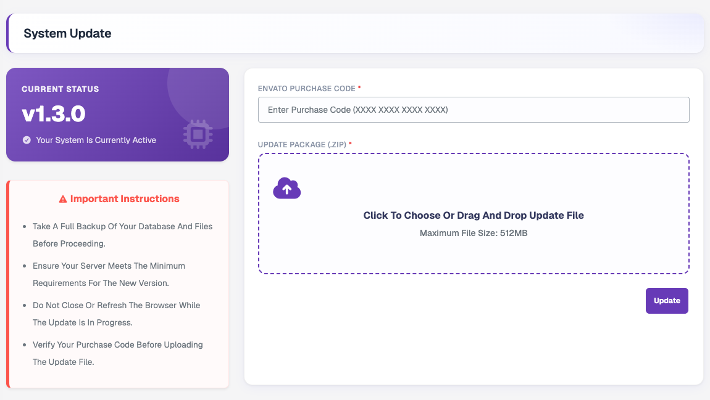

# How to Update Panel to Version 1.4.0

:::danger Read this first
Before you run the **System Update** to v1.4.0, you **must** complete the manual file replacement steps on this page.

Skipping these steps, or replacing the files in the wrong order, may cause the system update to fail or result in application errors.
:::

## Overview

| Step | What you do |
|---|---|
| [Step 1](#step-1--backup-your-existing-server-files) | Back up your existing server files. |
| [Step 2](#step-2--replace-vendor-and-bootstrap-folders) | Replace the `vendor/` and `bootstrap/` folders. |
| [Step 3](#step-3--proceed-with-the-v140-system-update) | Run the System Update from the admin panel. |
| [Final verification](#final-verification) | Check that everything works. |

---

## Step 1 — Backup your existing server files

:::warning Important
Before making any changes to your hosted server, take a **complete backup** of your existing eLMS installation.
:::

We strongly recommend keeping a backup of:

- The current `vendor/` folder
- The current `bootstrap/` folder

The backup lets you restore the previous version if the update runs into any unexpected issue. Also back up your database.

---

## Step 2 — Replace vendor and bootstrap folders

We have provided the updated files required for v1.4.0 in the **Update v1.4.0** folder of your download package. It contains:

- `bootstrap.zip`
- `vendor.zip`

### 1. Upload the ZIP files

Upload both ZIP files to the **root directory** of your existing eLMS installation. For example:

```text
/path/to/elms/
```

### 2. Delete the old folders

Before extracting the ZIP files, delete the following existing folders from your server:

```text
bootstrap/
vendor/
```

:::danger Do not delete your .env file
Your `.env` file holds your environment configuration. Do **not** delete or replace it.
:::

### 3. Extract the ZIP files

Extract `bootstrap.zip` and `vendor.zip` **directly into your application root directory**.

### 4. Check the folder structure

After extraction, verify that this structure exists:

```text
/path/to/elms/
├── bootstrap/
├── vendor/
├── .env
└── ...
```

Make sure the folders were extracted correctly and are **not nested inside another directory**. For example, `/path/to/elms/vendor/vendor/` or `/path/to/elms/vendor/autoload.php` missing is a sign of a wrong extraction.

---

## Step 3 — Proceed with the v1.4.0 System Update

Once all the steps above are complete:

1. Open your eLMS **Admin Panel**.
2. Log in using your administrator account.
3. Go to **Settings → System Update**.
4. Enter your purchase code, upload the v1.4.0 update package ZIP and click **Update**.
5. Wait for the system update to finish.



:::caution
Do **not** close the browser or interrupt the update while it is running.
:::

For the full System Update page description, see [Settings → System Update](/features/admin-panel/settings#system-update).

---

## Final verification

After the v1.4.0 update is complete, check the following:

- [ ] Admin Panel is accessible.
- [ ] Website is accessible.
- [ ] Login and logout are working.
- [ ] Listings are loading correctly.
- [ ] Images and files are loading correctly.
- [ ] API requests are working correctly.
- [ ] Database operations are working correctly.
- [ ] No PHP or Laravel errors are displayed.
- [ ] System Update shows the correct version: **v1.4.0**.

---

## Important notes

:::danger Do not delete .env
Do **not** delete this file:

```text
.env
```

Your existing environment configuration must remain unchanged unless the v1.4.0 update documentation specifically tells you otherwise.
:::

- **Do not** replace the entire application directory blindly.
- Only replace the files and folders specifically mentioned in this update guide.
- **Always take a backup before starting the update.**
