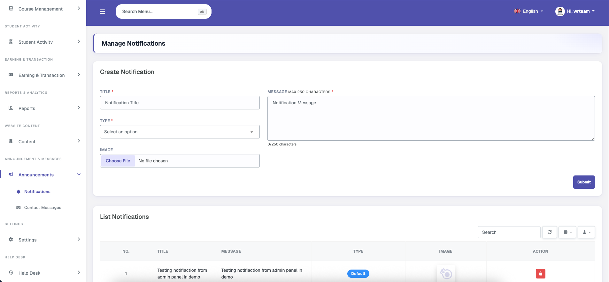
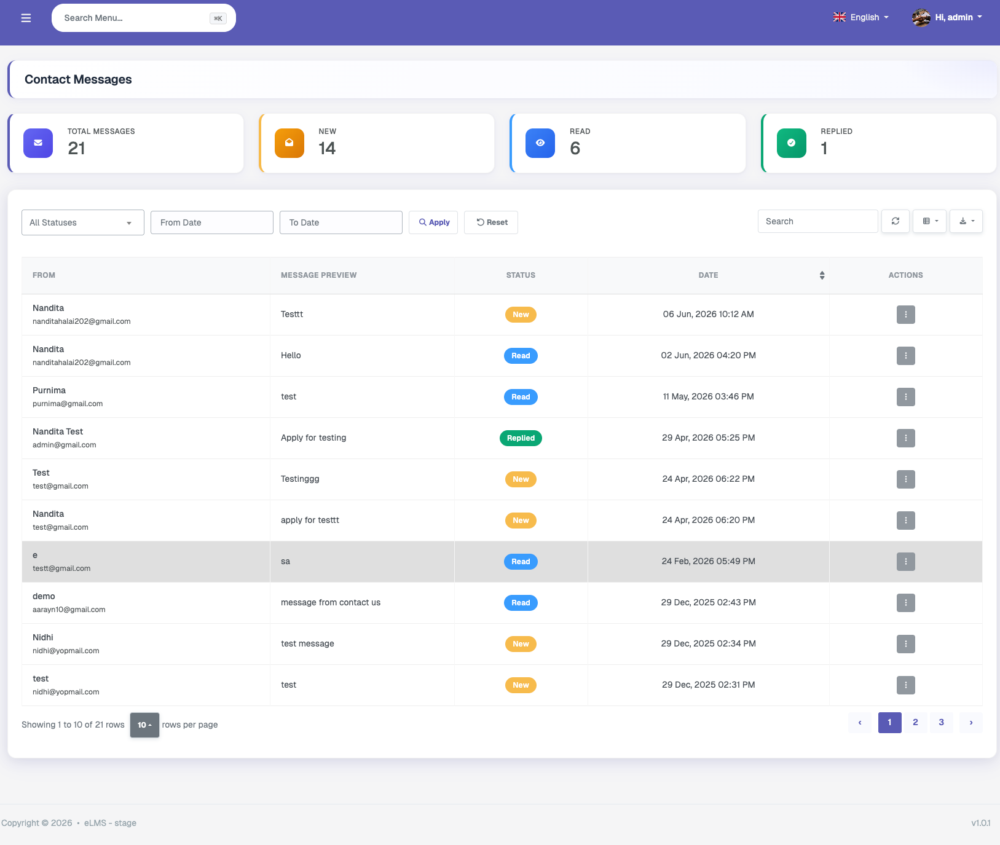

# Announcements

### Notifications

The admin can send FCM push notifications from this section. Each notification supports a title, message, and an optional image. A notification type must also be selected from the following options:

- **Default** – A standard notification with no specific action on tap.
- **Course** – Requires selecting a course; the user is redirected to that course on tap.
- **Instructor** – Requires selecting an instructor; the user is redirected to that instructor's profile on tap.
- **URL** – A custom URL can be entered; the user is redirected to that URL in the browser on tap.

Previously sent notifications are listed below with a delete option and are also shown to users on their notifications page.

### Contact Messages

The website's Contact Us page includes a form where anyone can submit their name, email, and a message. These submissions are shown to the admin here. The admin can manually manage the status of each message, and the total number of new messages is shown as a badge in the sidebar. Follow-up communication can be handled by the admin directly via email.
