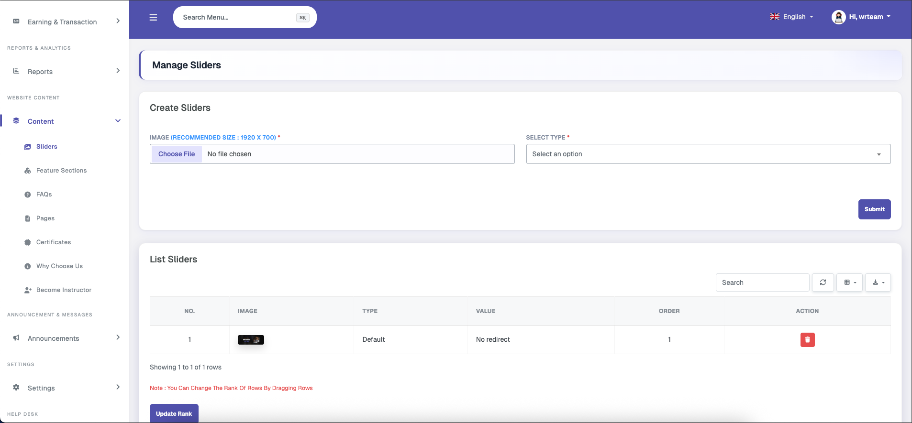
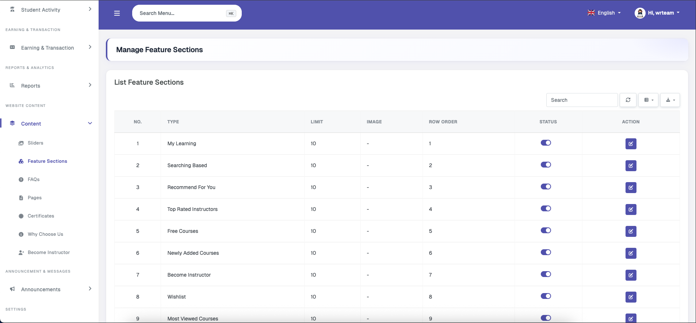
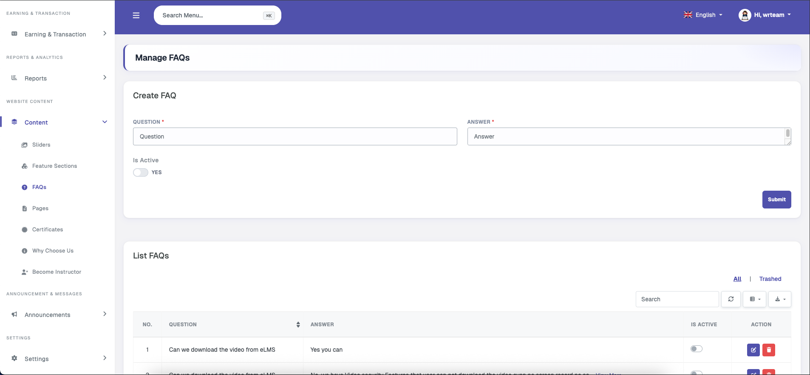
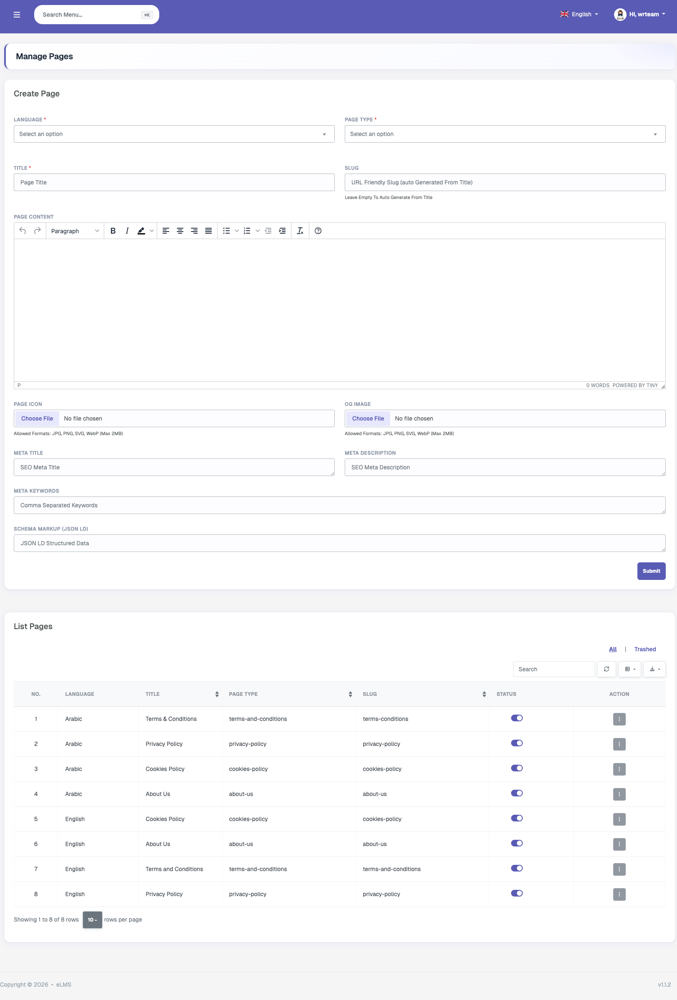
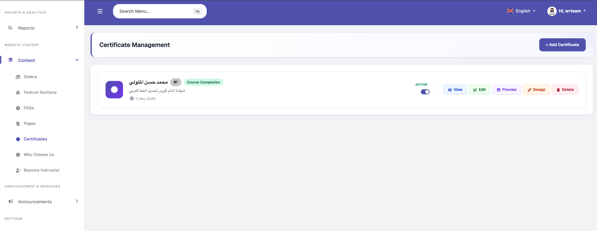
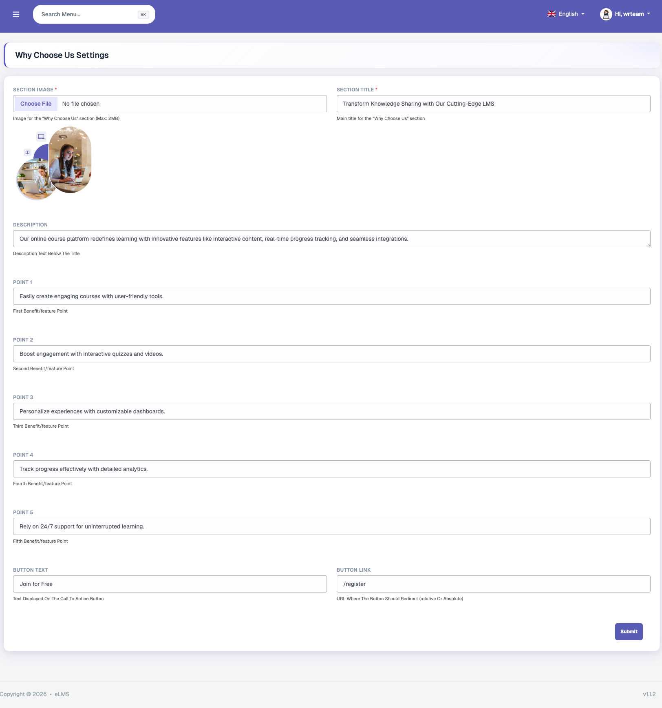
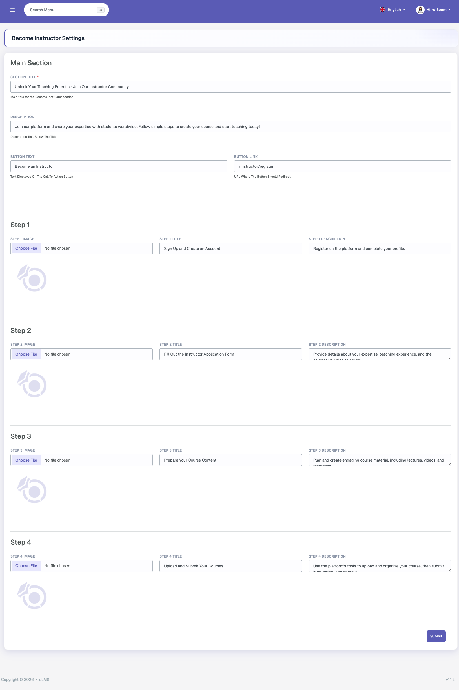

# Content

### Sliders

Slider images displayed on the home page of the application and website can be managed from here. Each slider image has a type: Default (no action on tap), Custom Link (redirects to a custom URL on tap), Course (redirects to a specific course on tap), or Instructor (redirects to a specific instructor on tap). Sliders can be reordered or deleted from the table.

### Feature Sections

eLMS supports 10 different types of featured sections on the home page. Each section can be individually enabled or disabled, the item display limit can be adjusted, and sections can be moved up or down in rank to control the order in which they appear in the application and website. An image can also be added specifically for the offer feature section.

### FAQ

FAQs can be created with a question and answer in single-language text fields. They are displayed on the home page of the website and in the Help & Support section of the application and website.

### Pages

HTML content pages can be managed from this section. The following page types are currently supported: About Us, Cookies Policy, Privacy Policy, Refund Policy, and Terms and Conditions. These pages are displayed in the application and website with single-language support.

### Certificates

Course completion certificates can be created, customised, and managed from this section. Each certificate entry includes a name, description, title, subtitle, background image, signature image, signature text, and active or inactive status. After creation, the certificate can be further styled using a dedicated styling editor that supports adding text, images, and dates. Two special variables — **Student Name** and **Course Name** — can be placed anywhere in the certificate design and are automatically replaced with the actual values when a student downloads their certificate.

### Why Choose Us

This section allows customisation of the Why Choose Us content block on the website's home screen, which is shown to non-logged-in users. It supports adding an image, a section title, a description, up to 5 feature points, and a customisable button with its own text and link.

### Become an Instructor

This section is used to update the content of the website's Become an Instructor page. It allows editing the page's title, description, button text, button link, and 4-step onboarding data — each step supporting an image, title, and description. This page is accessible from the Become an Instructor button on the website.
