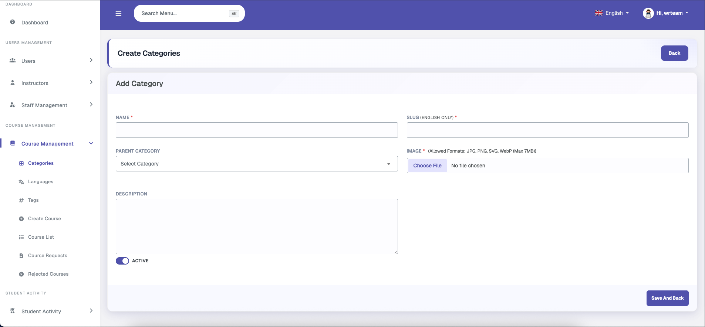
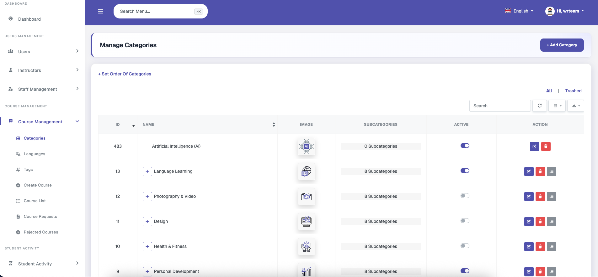
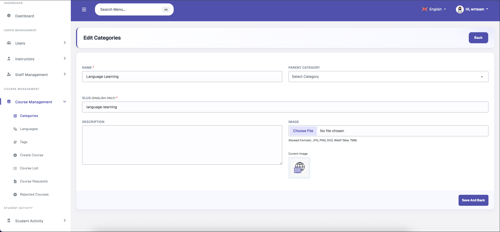
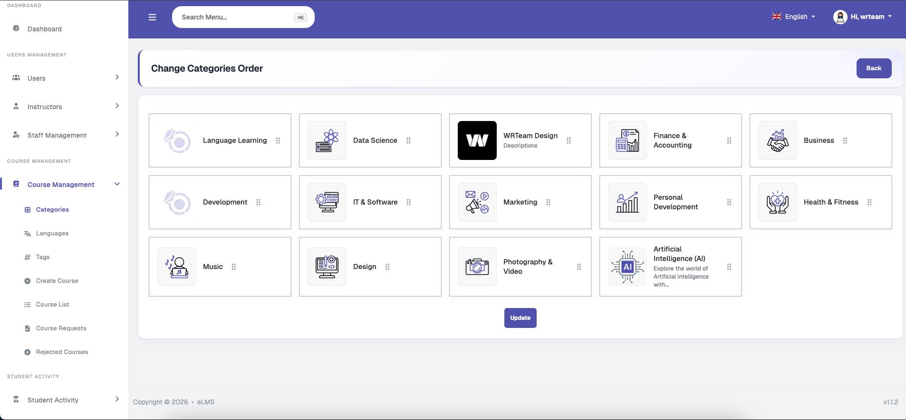
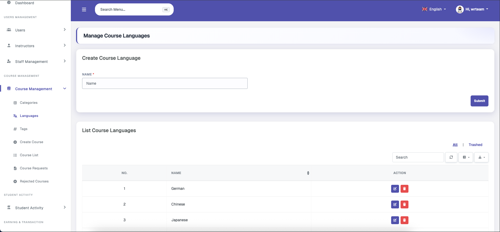
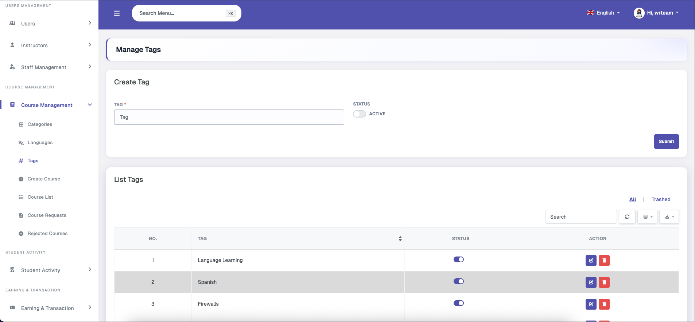
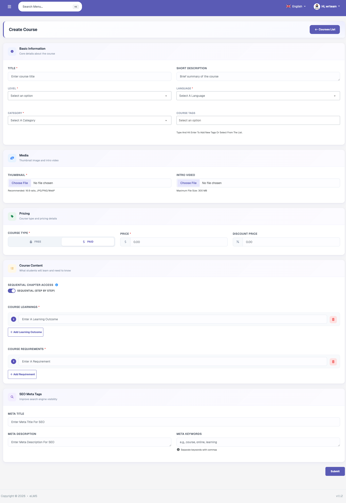
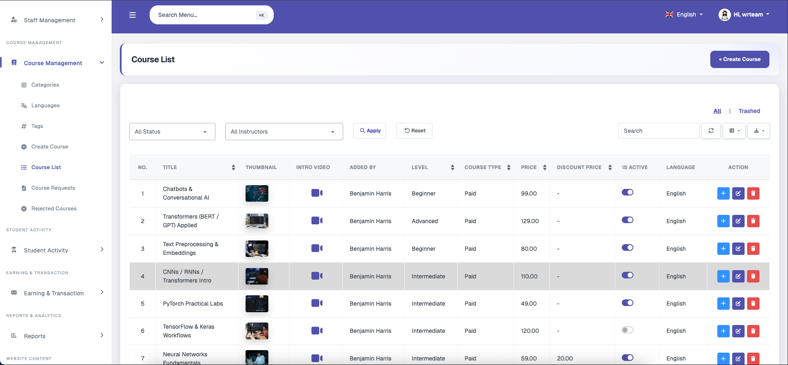
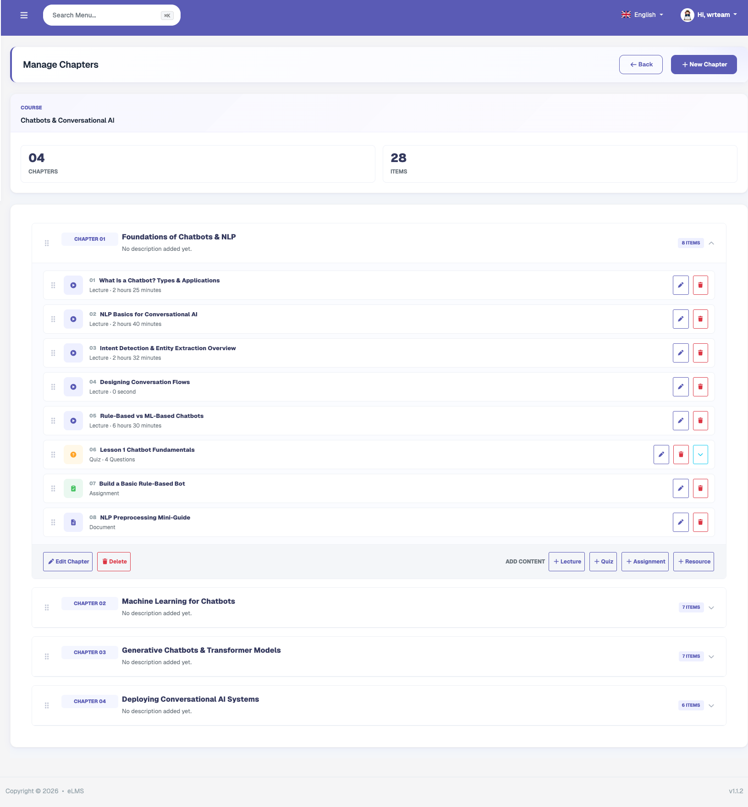
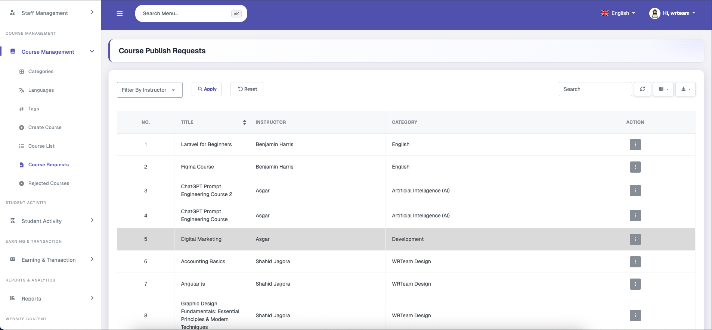

# Course Management

This section includes global course-related one-time detail management options, as well as admin course creation and course request review functionality.

### Categories

Categories and sub-categories (up to 3 levels deep) can be managed from here. Each category includes a name, slug, description, and image, and can be connected to a parent category. These categories form the foundational structure on top of which courses are added. Sub-category courses do not appear in the parent category's filter, since each category is treated as individual and unique even when nested.

### Languages

This section allows the admin to manage the list of available languages. Any number of languages can be added with a name, and one language can be associated with each course to indicate the language in which the course is taught.

### Tags

Tags can be created with a name and deactivated if needed; tag names must be unique. Multiple tags can be selected when adding course details, and users can search and filter courses using these tags.

### Create Course

Admins can create their own platform courses from this section by entering all required course details, including: Title, Description, Thumbnail, Intro Video, Level, Payment Type (free or paid), Price, Discount Price, Category, Tags, Language, Learning Outcomes, Requirements, SEO Meta Tags, and Sequential Chapter Access (enabled or disabled — for step-by-step learning or free-form navigation). Once a course is created, its curriculum must be added before it can be published.

### Course List

Allows the admin to view all courses with options to filter by status or instructor. Actions include editing or deleting a course. Deletion is a soft-delete, meaning the course can be restored from the trashed courses list or permanently deleted from the trash. A quick action button also provides a shortcut to the Create Course screen.

### Course Chapters

Allows the admin to manage chapters within added courses. A chapter can have a title and description. Within each chapter, lessons can be added in the following types: Lecture (video or file), Resource (files), Quiz (question and answer), and Assignment (to be submitted by students and reviewed by the course owner). Each lesson type can be viewed by learners and progress can be tracked by users and course owners. Each lesson type is described in more detail under the Instructor Features section.

### Course Requests

Displays instructor course publishing requests, which the admin can view, approve, or decline.

### Rejected Courses

Displays the list of rejected courses with a view details option. These courses can be edited by the respective instructor and resubmitted for approval.
