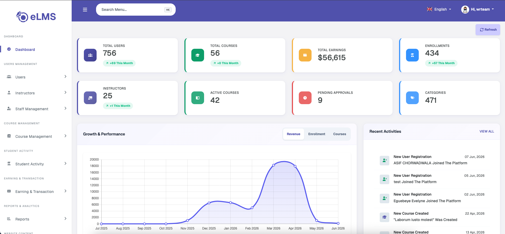
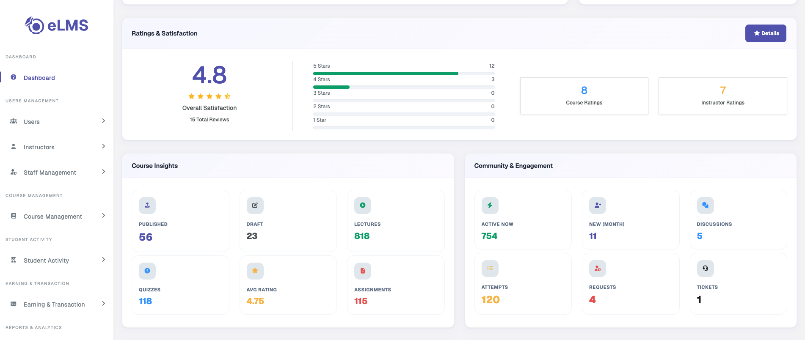
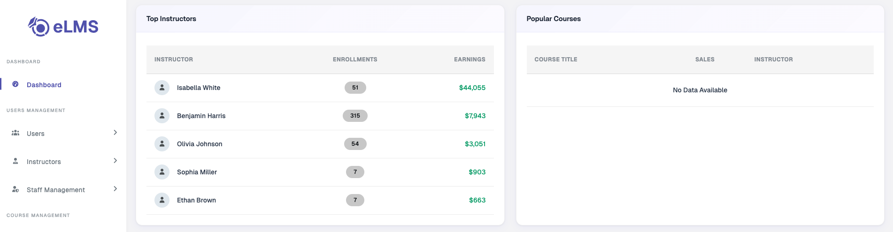
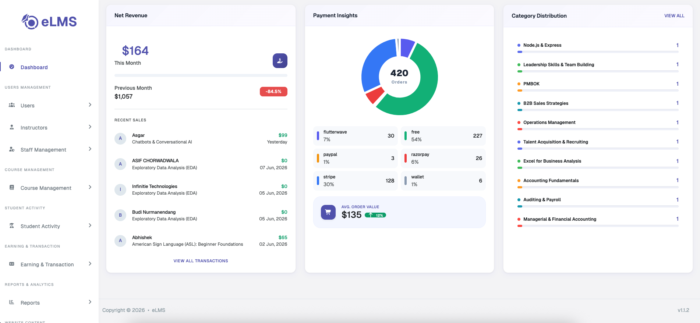

# Dashboard

The admin panel dashboard showcases different figures, metrics, charts, and activities, with a refresh data option to retrieve the latest information at any time.

### General Statistics

- **Total Users** – The total number of users registered on the platform.
- **Total Courses** – The total number of courses added on the platform.
- **Total Earnings** – Total revenue generated from course sales across the entire platform.
- **Total Enrollments** – The total number of user enrollments across all courses.
- **Total Instructors** – The total number of instructors registered on the platform.
- **Active Courses** – The number of courses that are approved and live for users to view.
- **Courses Pending Approval** – The number of courses that have not yet been approved or rejected.
- **Total Categories** – The total number of categories and sub-categories in which courses can be added.

### Growth & Performance

A graph displaying monthly data from the past year through the present, with three filtering options: Revenue, Enrollment, and Courses.

### Recent Activities

Displays a list of recent platform activities, including new user registrations, course creations, and orders placed, along with their timestamps.

### Ratings & Satisfaction

Displays the overall ratings for instructors and courses, including average ratings and star-wise rating totals. A **Details** button redirects to the Ratings Management page for a more in-depth view.

### Course Insights

Displays the following values related to courses: Published Course Count, Draft Course Count, Total Lectures Count, Total Quizzes Count, Average Ratings on Courses, and Total Assignments Count.

### Community & Engagement

Displays the following values related to user engagement: Active Users Count, Current Month New User Count, Discussions Count, Quiz Attempts Count, Pending Instructors Count, and Support Tickets Count.

### Top Instructors

Displays the top 5 instructors who have generated the most revenue on the platform.

### Popular Courses

Displays the top 5 courses with the highest enrollment count.

### Net Revenue

Displays the revenue for the current and the previous month along with the growth percentage.

### Payment Insights

Displays the income flow from different payment methods — including revenue from orders placed via different payment gateways and wallets — along with the average order value.

### Category Distribution

Displays the total number of courses in each category, listed from the most to the least populated.
