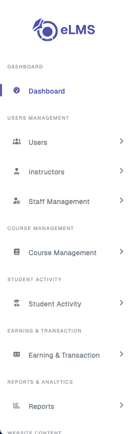
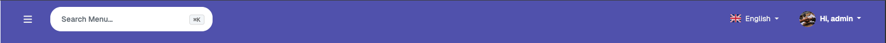
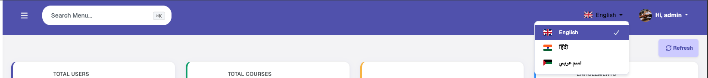
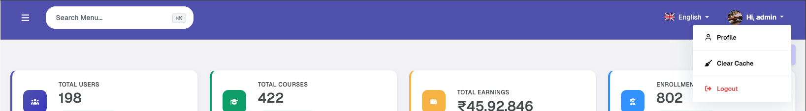
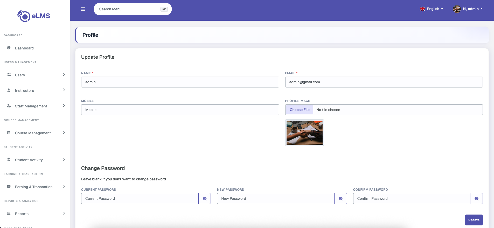

# Header Options

The admin panel global header includes the following features:

### Sidebar

The sidebar includes group-wise feature pages that can be accessed easily, with an expand and collapse toggle for better navigation management.

### Search Menu

The menus and sub-menus can be quickly searched from this search bar to access them without having to locate them manually in the sidebar.

### Language Change

The language-change drop-down allows the admin user to change the language of labels to any of the available languages that have been added in the settings.

### Profile

The profile option allows the admin user to view and edit their profile details — including name, email, mobile number, profile image, and password — as well as clear the panel's local cache and log out.

