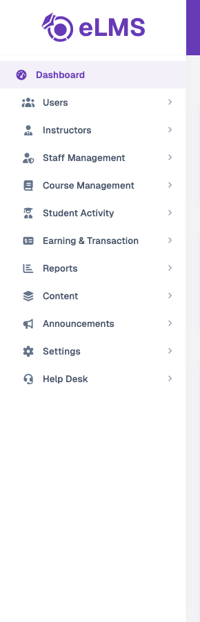
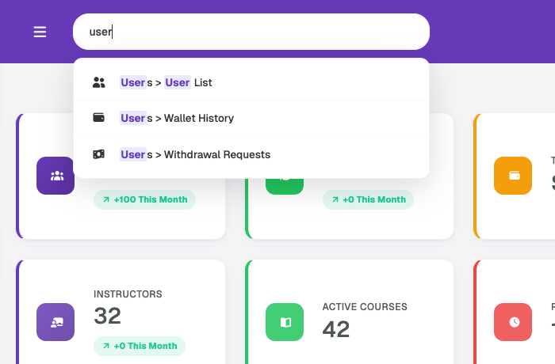
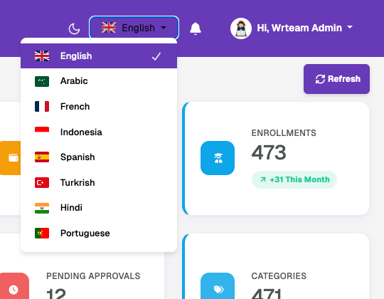
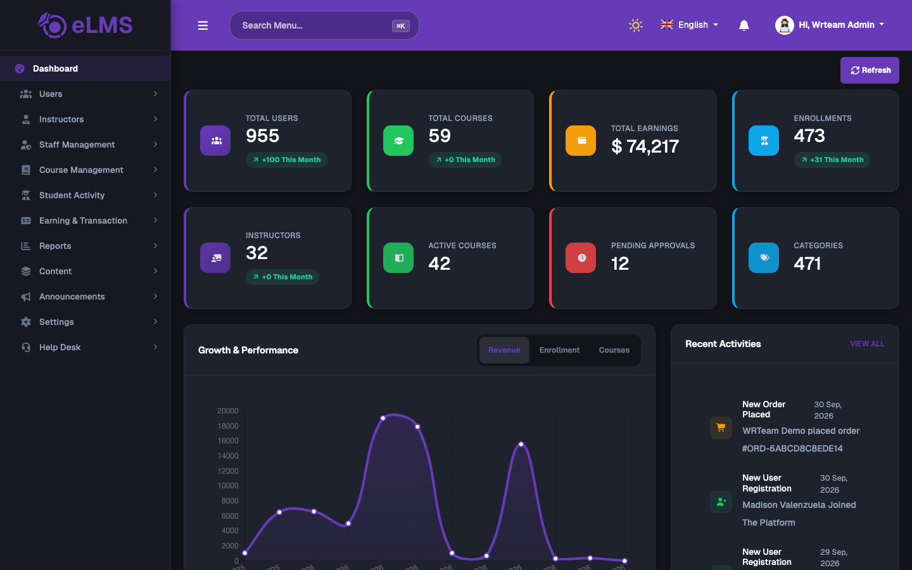
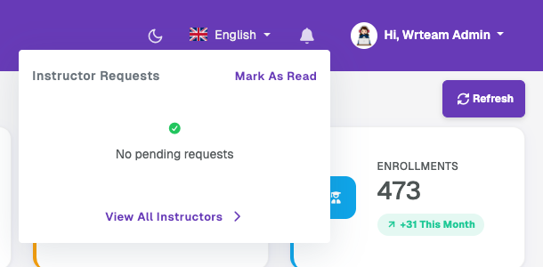
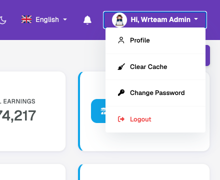
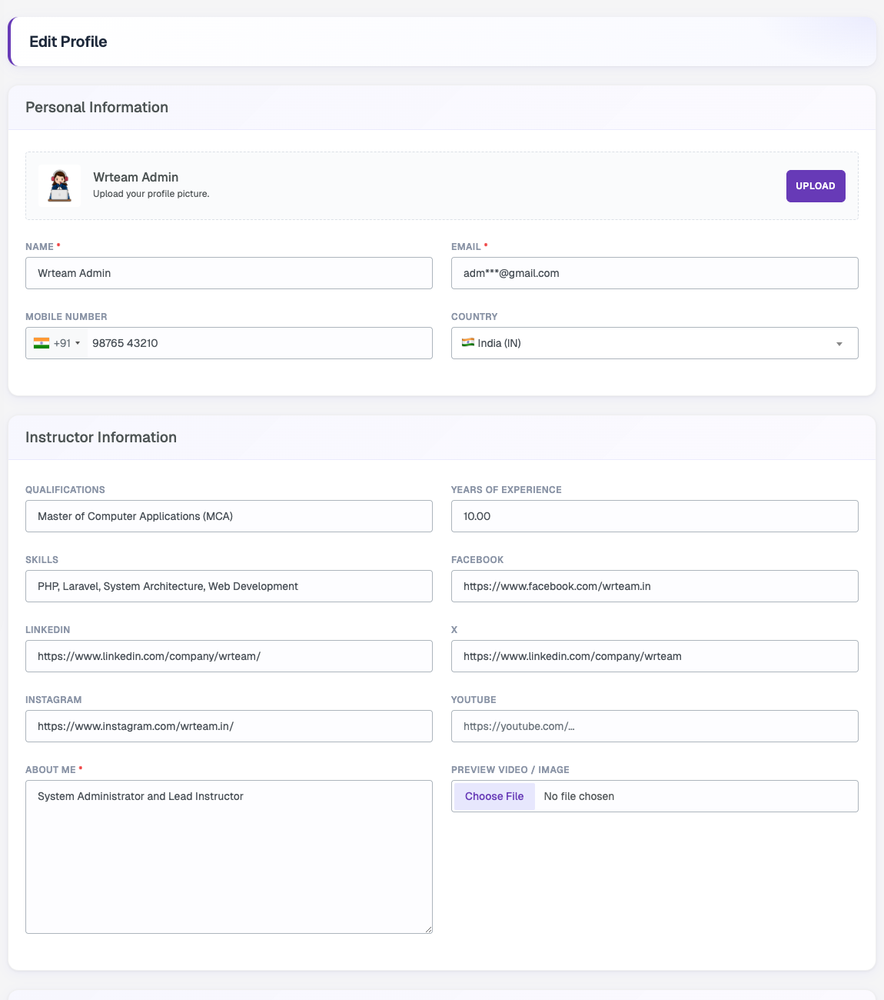
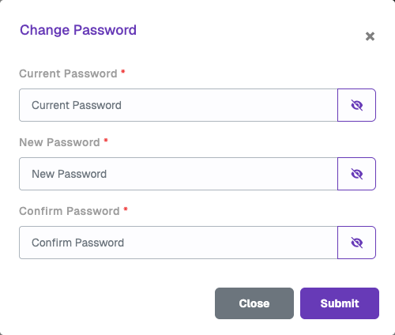

# Header Options

The admin panel global header includes the following features:

### Sidebar

The sidebar includes group-wise feature pages that can be accessed easily, with an expand and collapse toggle for better navigation management.

### Search Menu

The menus and sub-menus can be quickly searched from this search bar to access them without having to locate them manually in the sidebar.

### Language Change

The language-change drop-down allows the admin user to change the language of labels to any of the available languages that have been added in the settings.

### Dark Mode

The moon icon in the header switches the admin panel between light and dark themes. Click the icon again (it becomes a sun) to return to the light theme.

### Instructor Notifications

The bell icon shows pending instructor requests that need the admin's attention. Use **Mark As Read** to clear the notifications, or **View All Instructors** to open the Instructor List and review the requests. When there are none, "No pending requests" is shown.

### Profile

The profile drop-down in the top-right corner includes **Profile**, **Clear Cache**, **Change Password**, and **Logout**. **Profile** opens the Edit Profile page, where the admin user can update their personal and instructor information — including name, email, mobile number, country, profile image, qualifications, skills, and social links. **Clear Cache** clears the panel's cache, and **Change Password** updates the account password.

### Change Password

Choose **Change Password** from the profile drop-down to update the admin account password. Enter the **Current Password**, the **New Password** and **Confirm Password**, then click **Submit**. Use the eye icon in each field to show or hide the password.

### Clear Cache

Choose **Clear Cache** from the profile drop-down to clear the panel's cached data and reload the latest settings. Use it after changing settings or updating the system if the panel still shows old data.
