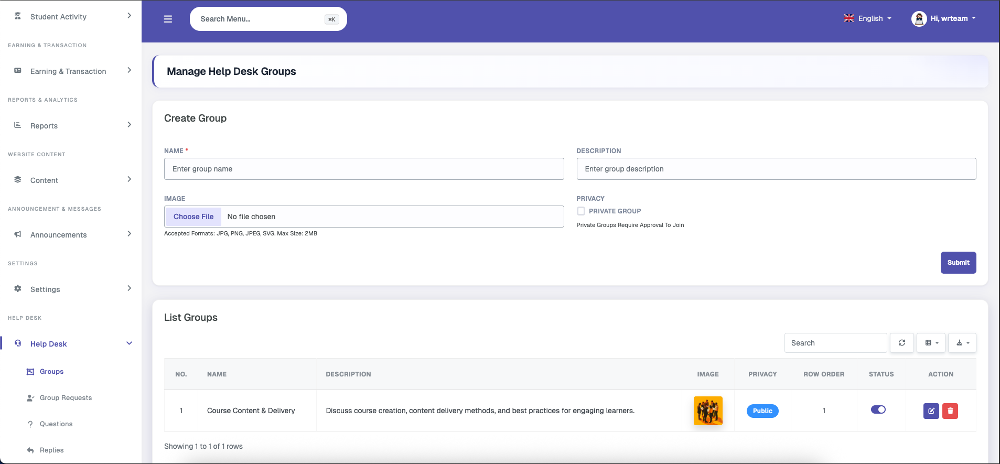
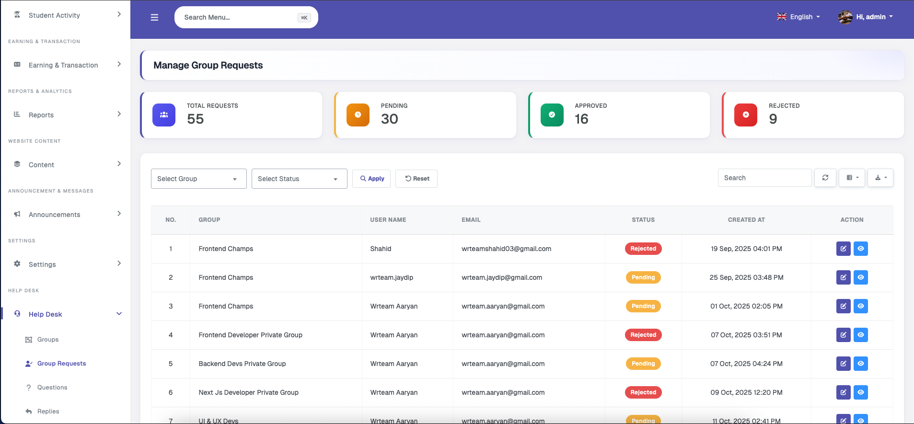
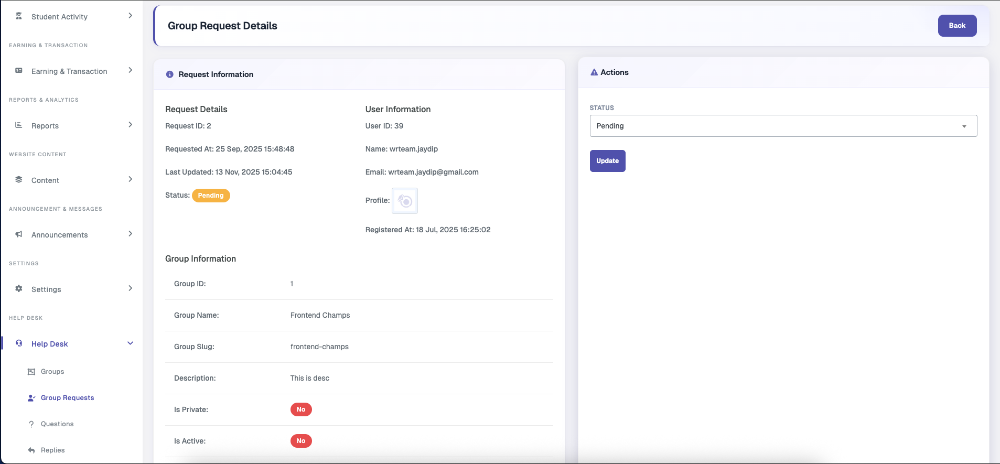
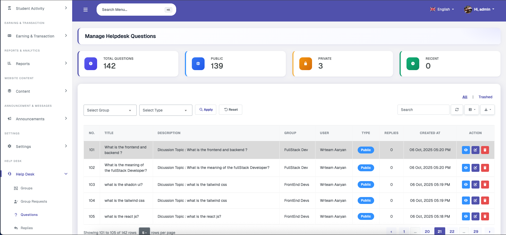
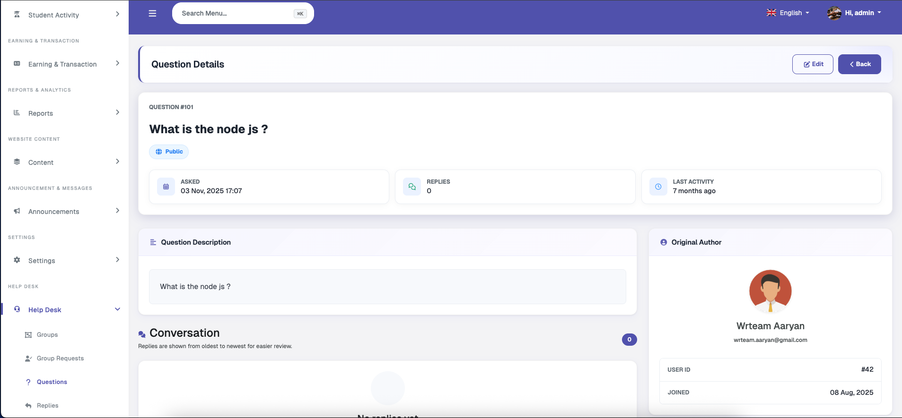
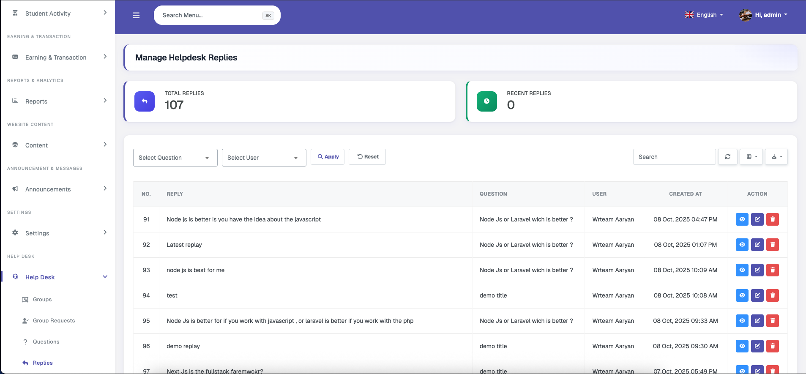
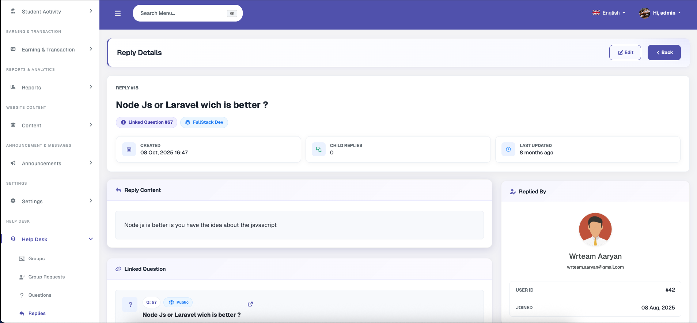

# Help Desk

### Groups

Help desk community groups can be managed from here. New groups can be created with a name, description, optional image, and a privacy setting — a private group requires approval before users can join. Existing groups can be edited, deleted, activated or deactivated, and reordered.

### Group Requests

Displays pending join requests from users for private groups. Each request can be approved or rejected. Approved users gain access to view the group's conversations and post questions.

### Questions

Allows the admin to view all questions posted by users across all groups. The admin can edit or delete any question.

### Replies

Admins can view other users' replies within question threads, as well as add their own replies.

