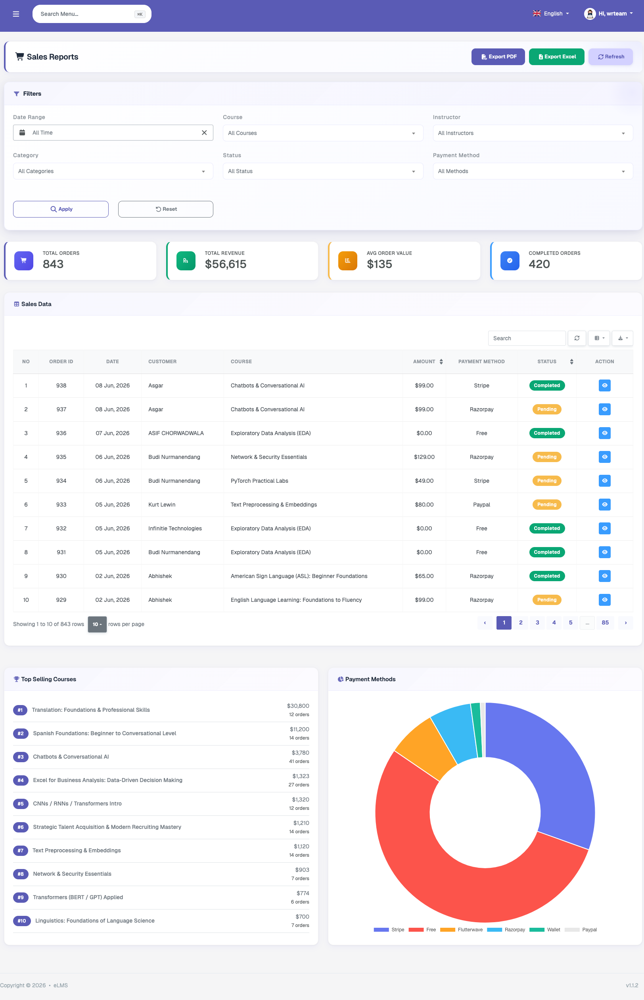
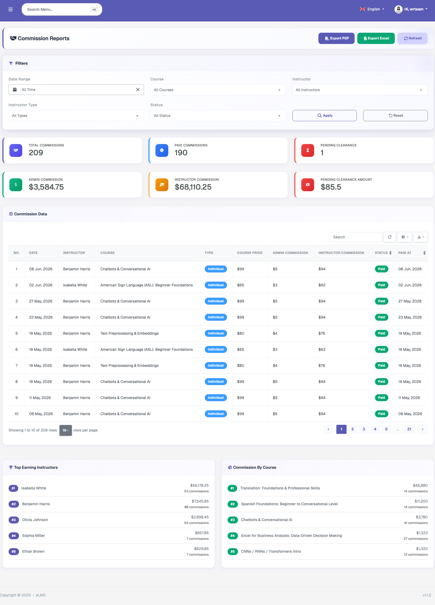
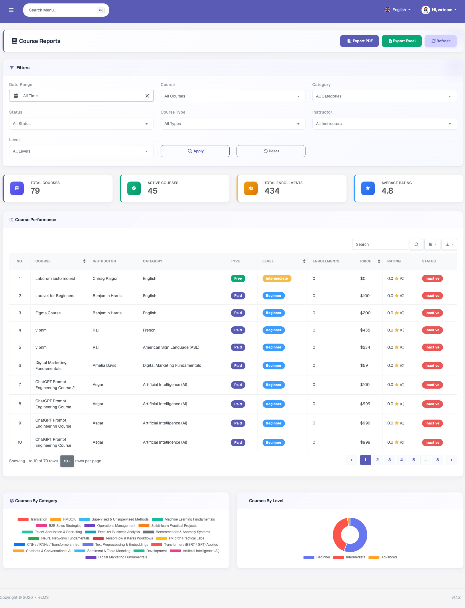
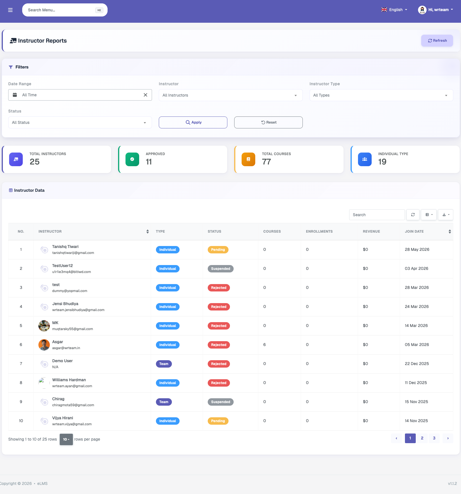
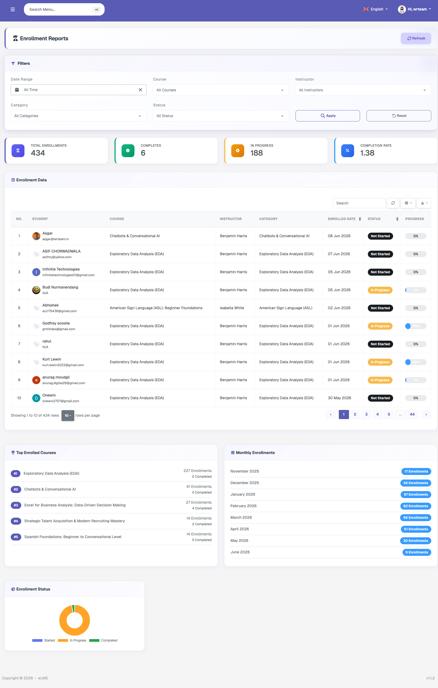
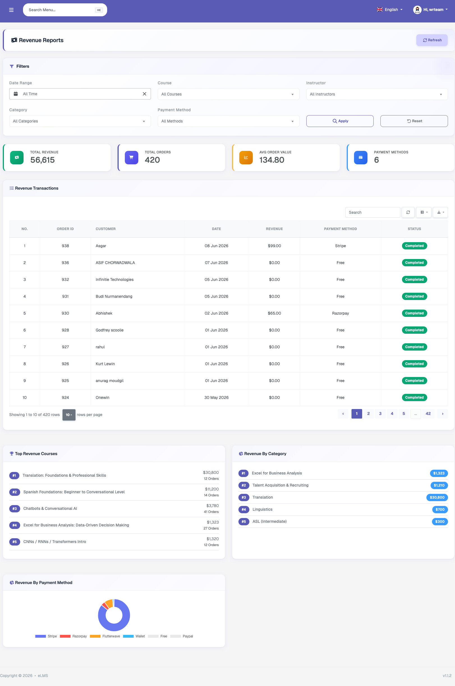

# Reports

This section provides different types of detailed reports, each with filtering options for statistics and report items, along with data export options in PDF and Excel formats.

### Sales

Displays order and revenue-related statistics and a complete sales list with multiple filtering and export options. The top-selling courses and payment methods graphs are shown below the report data.

### Commission

Displays the admin's commission reports. Each instructor course sale on the platform is settled and the platform commission is accounted for here. This section shows detailed statistics of admin earnings, instructor earnings, clearance statuses of course purchases, and a full commission transaction list. The top-earning instructors and commission-by-course breakdowns are also displayed.

### Course

Displays data related to courses available on the platform, including published course count, enrollment statistics, course ratings, courses by category, and courses by level.

### Instructor

Lists all instructors on the platform with a filtering option. Displays approved instructor count, total instructor count, total courses by instructors, and for each individual instructor: their course count, total enrollments, total revenue, and joining date. A report download option is not included as it is not required for this section.

### Enrollment

Displays enrollment statistics — including total enrollments, completed, in-progress, and completion rate — along with an individual student's course enrollment list. Each item shows the completion status (Not Started, Started, In Progress, or Completed) and a progress percentage bar. Below the list, the top enrolled courses, monthly enrollment counts, and enrollment status percentages are also shown.

### Revenue

Displays revenue statistics — including Total Revenue, Total Orders, Average Order Value, and payment method breakdown — at the top, followed by a full transaction history table. Top revenue courses, revenue by category, and revenue by payment method are displayed below the list.
