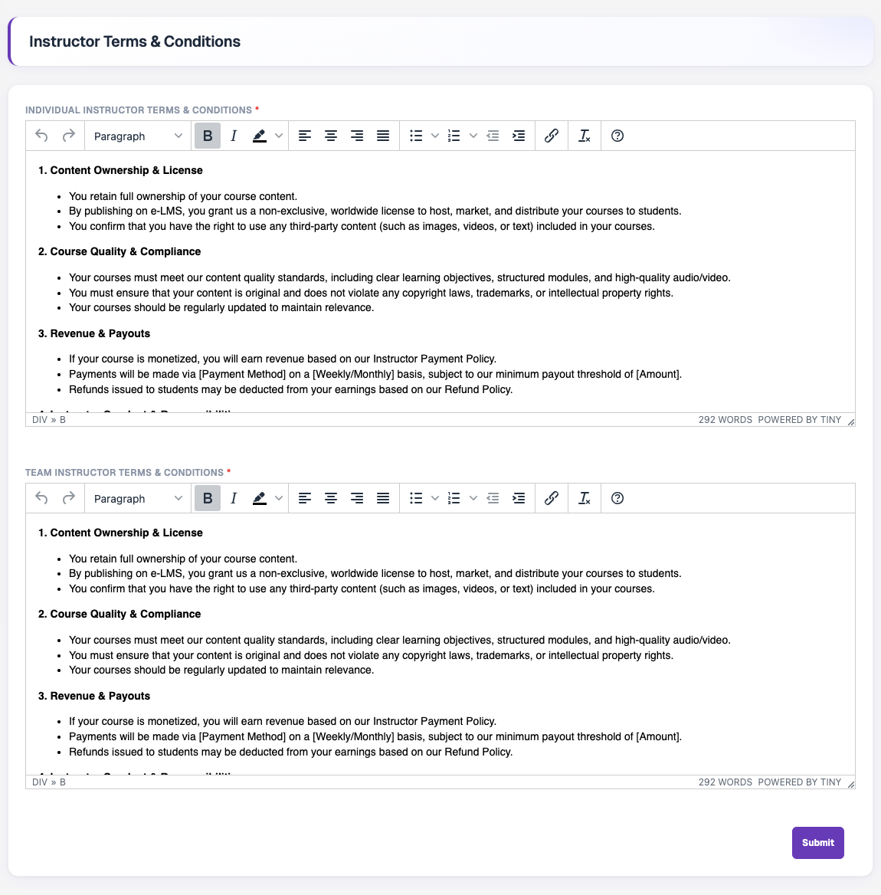
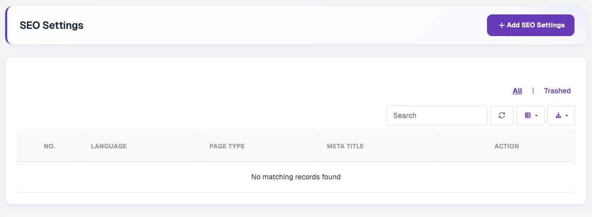
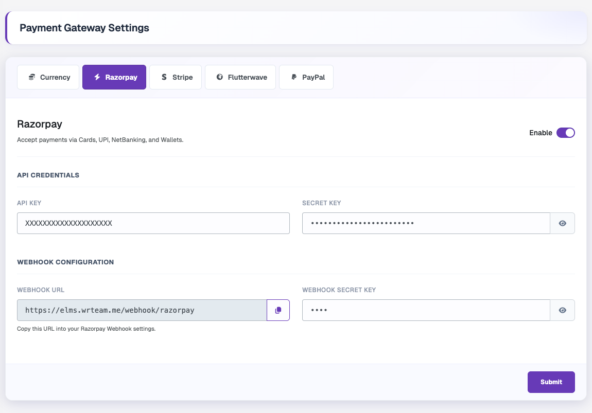
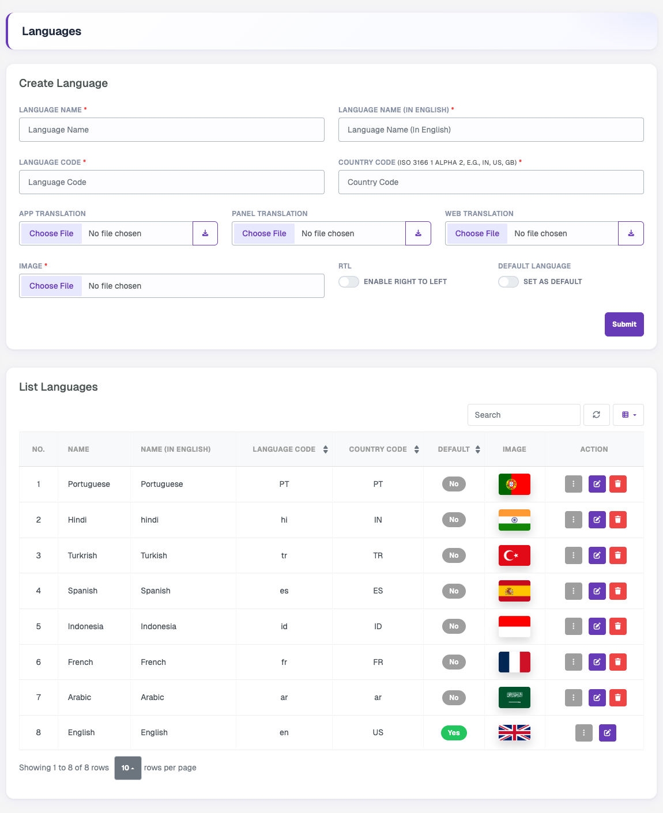
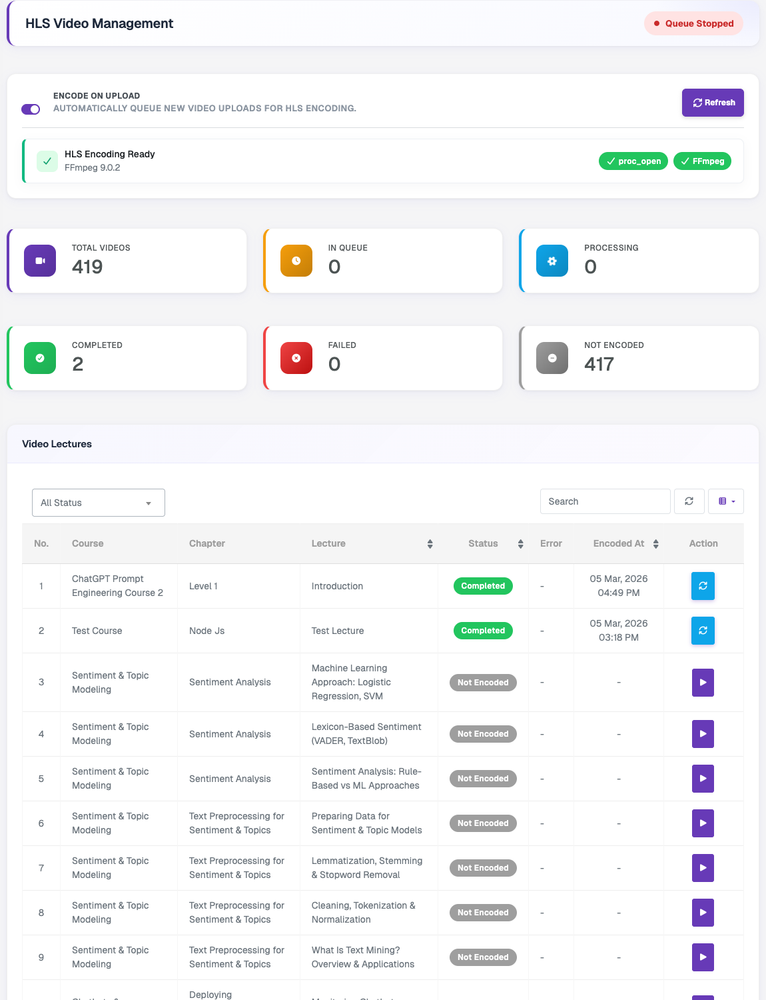
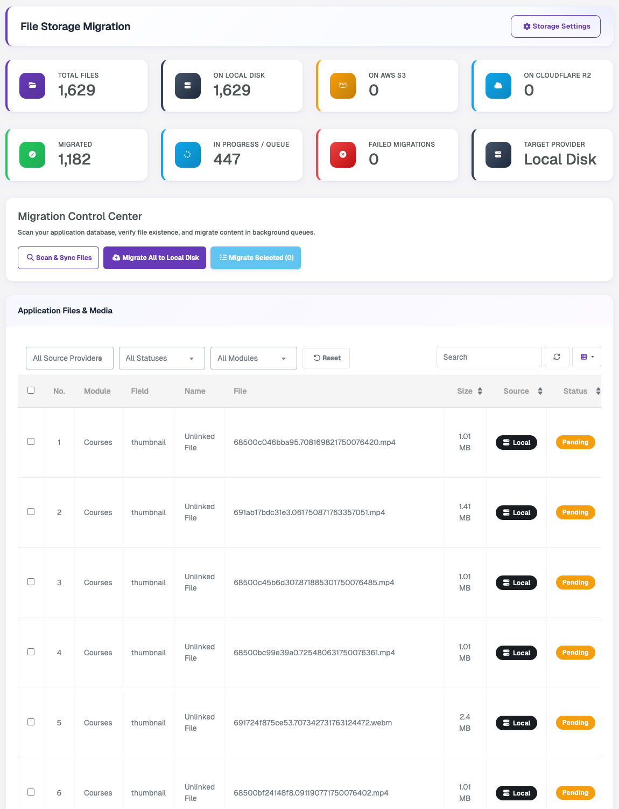

# Settings

These settings are intended for one-time configuration following admin panel installation. Required parameters are pre-filled with default eLMS values where applicable.

## System Settings

The System Settings section serves as the core configuration hub for your platform's identity, contact details, operational modes, and basic configurations. It is divided into the following tabs, each with its own **Submit** button:

### General

Configure the platform name, schema, maximum video upload size, default timezone, weekly average watch hours, and maintenance mode.

### Branding

Upload the vertical logo, favicon, login banner image, and placeholder image used across the platform.

### Contact

Manage the business contact details displayed across the platform, including the organisation address, contact email, and contact phone number for user inquiries and support.

### Instructor

Controls whether the platform operates in Single Instructor mode or Multi Instructor mode, and whether instructors are allowed to create their own certificates. In Single mode, only the admin acts as the instructor. In Multi mode, separate instructor accounts are enabled along with the full instructor management functionality.

### Commission

Allows admins to define the revenue-sharing percentages between the platform and instructors, configured separately for individual instructors and team instructors. The platform fee percentage is configurable, and the instructor's earnings are automatically calculated based on the selected split.

### Refund

Allows admins to enable or disable refunds, define the number of days after purchase during which users can submit a refund request, and configure the response window allowed for instructors. This tab also provides the cron job command required for automatically processing pending commissions, live class reminders, and cleanup tasks on the server.

### Social Media

Allows admins to manage and configure social media links and platform profiles that are displayed throughout the website for branding and user engagement purposes.

### Storage

Choose where newly uploaded files are stored: Local Disk, Amazon S3, or Cloudflare R2. The active driver status can be verified with **Test Connection**, and existing files can be moved using the **File Migration Tool**.

---

## Theme Settings

Allows admins to change the primary brand color and neutral color palettes, and to update or reset the Success, Error, Warning, and Info status colors used across the admin panel, website, and app.

## Web Settings

Manage the website URL, web logo, announcement bar text, footer description, and website copyright text.

## Email Configurations

Allows admins to configure and manage the email delivery service used for sending transactional and system-generated emails such as OTPs, password resets, notifications, and purchase confirmations. Supported mail providers include SMTP, Send Mail, Mailgun, and Postmark, with SSL and TLS encryption options for secure communication. Admins can configure server credentials, sender details, and mail delivery settings, and can also verify the configuration by sending a test email directly from the panel.

## Firebase

Allows admins to configure Firebase integration by adding the Firebase Project ID and uploading the Firebase Service Account JSON file. This configuration is required for the backend to securely connect with Firebase Cloud Messaging (FCM) and send push notifications to the mobile applications and website.

## Instructor Terms

Allows admins to manage separate terms and conditions for Individual Instructors and Team Instructors. These terms are displayed to instructors during the onboarding or registration process, and instructors must accept them before joining the platform. The content can be fully customised using the rich text HTML editor to include formatted text, lists, links, and other structured content.

## SEO

Allows admins to manage search engine optimisation details for website pages in multiple languages. Admins can create page-specific SEO configurations by selecting the target language and static page type, then adding meta titles, meta descriptions, keywords, schema markup (JSON-LD), and Open Graph images. The section also provides a listing page to view, search, edit, and manage all created SEO configurations across the platform.

## App

Allows admins to configure platform-specific mobile application details, including Play Store and App Store links used across the website and mobile applications for app sharing, rating, and redirection. This section also includes Android and iOS version management with a Force Update option, which requires users to be on the configured version or newer before they can continue using the application.

## Payment Gateway

Allows admins to configure and manage payment gateways used on the platform for course purchases and transactions. Admins can add gateway credentials such as API keys, secret keys, webhook details, encryption keys, currencies, and operating modes for each supported payment provider. Each payment gateway can be individually enabled or disabled, allowing the platform to support multiple online payment methods across different regions and currencies.

## Store Credit Payment

Allows admins to configure the required Apple App Store payment and server notification credentials for handling iOS in-app purchase validations. Admins can add the Issuer ID, Key ID, Private Key content, Bundle ID, and environment type, along with the App Store Server Notification URL for receiving transaction updates from Apple. A test connection option is also available to verify the configured credentials and notification setup.

## Languages

Allows admins to create and manage multilingual support for the platform by adding languages with their respective language codes, country codes, and flag images. Admins can upload separate translation files for the mobile application, admin panel, and website, enable right-to-left (RTL) layout support for applicable languages such as Arabic, and set a default system language. A language listing table is provided to view, search, edit, and manage all added languages and their translation configurations.

## System Update

Allows admins to update the backend system to newer product versions by uploading the provided update package ZIP file and entering the Envato purchase code for verification. The page displays the current system version, provides important update instructions, and validates the uploaded package before processing the system upgrade.

## HLS Management

Allows admins to manage and monitor video encoding for course lectures using the HLS streaming format. The page displays the server encoding status and FFmpeg availability, provides configuration options such as maximum upload size and automatic encoding on upload, and shows encoding statistics including queued, processing, completed, failed, and non-encoded video counts. A lecture-wise management table is also included, allowing admins to monitor encoding statuses, view errors, retry failed encodings, and refresh encoding data.

## File Migration

Allows admins to move application files and media between storage drivers (Local Disk, Amazon S3 and Cloudflare R2). The page shows file counts per provider along with migrated, in-progress and failed migrations. Use **Scan & Sync Files** to scan the database and verify files, then migrate all files or only the selected ones to the target provider in background queues. The files table can be filtered by source provider, status and module.
