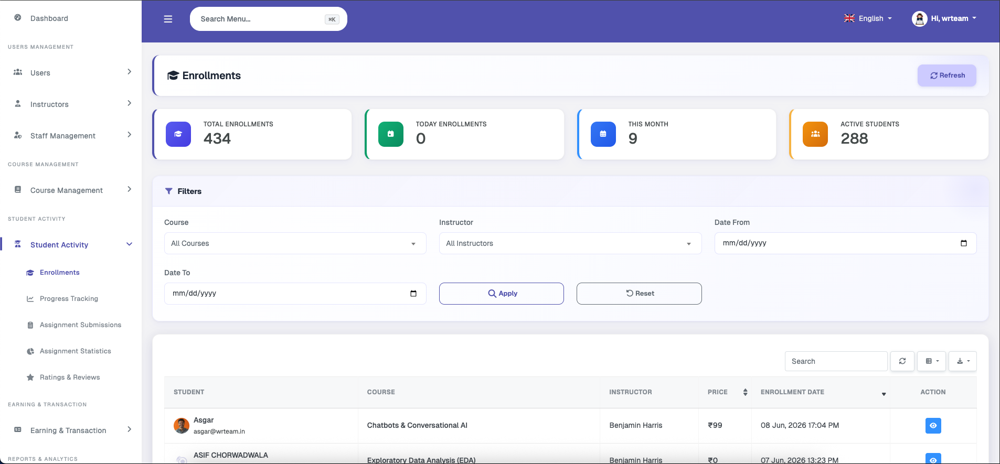
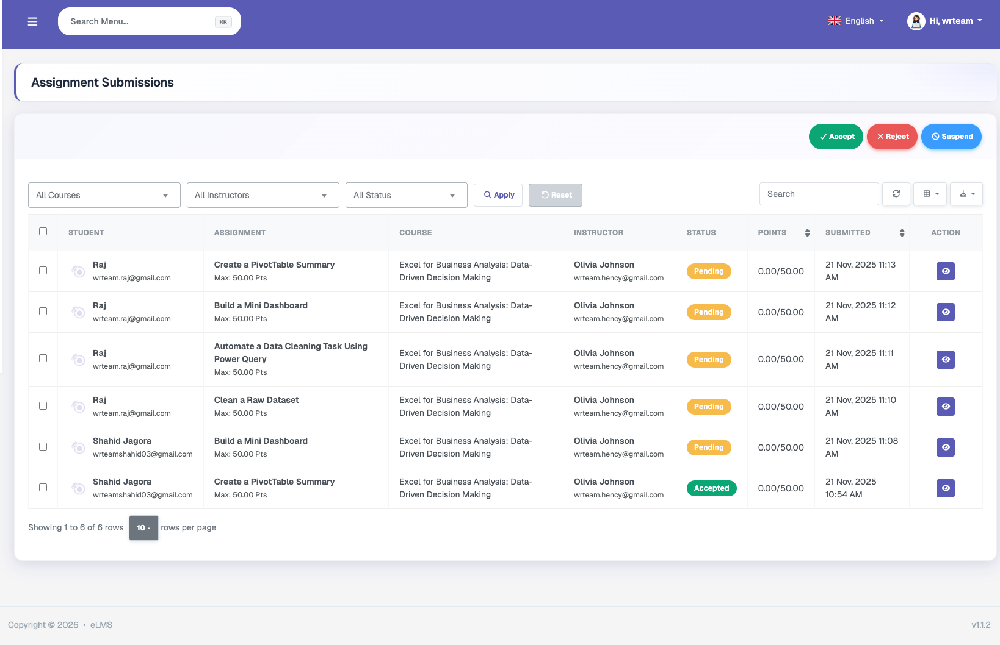
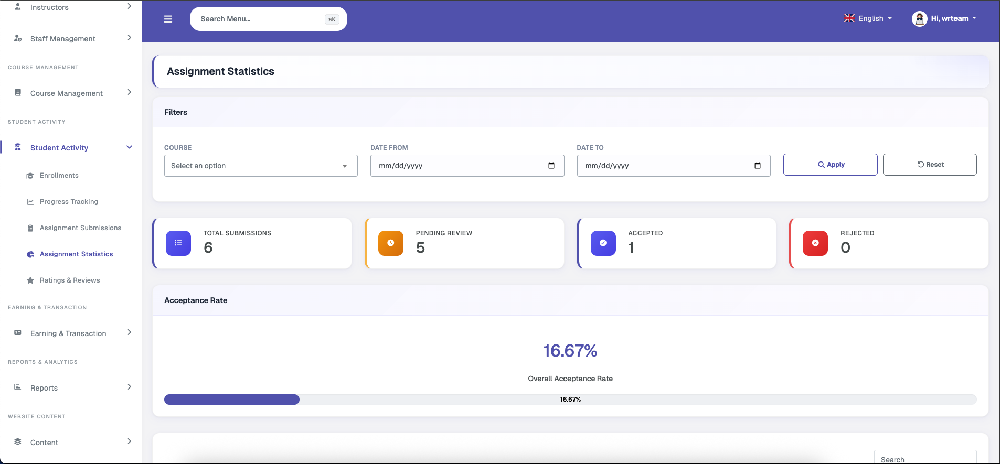

# Student Activity

### Enrollments

Displays enrollment statistics — including total enrollments, today's enrollments, this month's enrollments, and active student count — along with an enrollment list with date range, instructor, and course filtering options. Each enrollment can be viewed in detail, which includes course details, learner details, and action buttons to view the order details and track learning progress.

### Progress Tracking

Allows the admin to view the learning progress of different courses along with overall platform averages. It includes per-user, per-course progress tracking with a percentage progress bar and a view details option, as well as general statistics and filtering.

### Assignment Submissions

Displays assignment submission lists across all courses, with a bulk approve or reject option. Each submission can be viewed in detail to check the files submitted by the student. The status can be set to Accepted, Rejected, or Suspended, with an optional note. Suspended assignments cannot be resubmitted by the student.

### Assignment Statistics

Allows tracking of submissions for each assignment individually. Displays general statistics and filtering options, including total submissions, pending review count, accepted, rejected, acceptance rate, and course-wise submission counts and percentages. A recent submissions table is also available.

### Ratings & Reviews

Displays an overall view of all ratings and reviews submitted on the platform. Course Ratings, Instructor Ratings, and a Combined Rating bar are shown at the top, while the full list of reviews is displayed in the table below with filtering options and a view details button for each entry.
