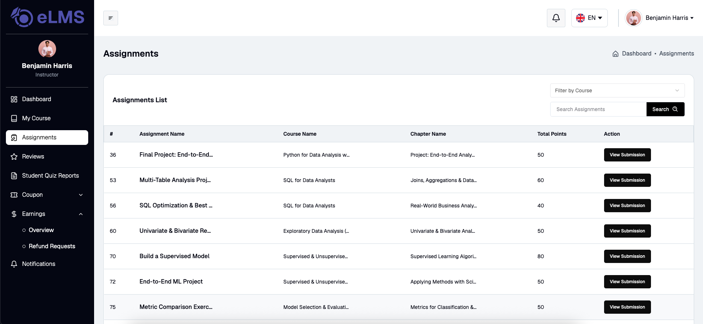

# Assignments

Displays the assignment list across all courses, with filtering options. Each assignment entry includes an action button to view its submissions, which lists all student submissions with individual action buttons. The instructor can review each submission and set the status to Accepted, Rejected, or Suspended, along with marks and a note.
