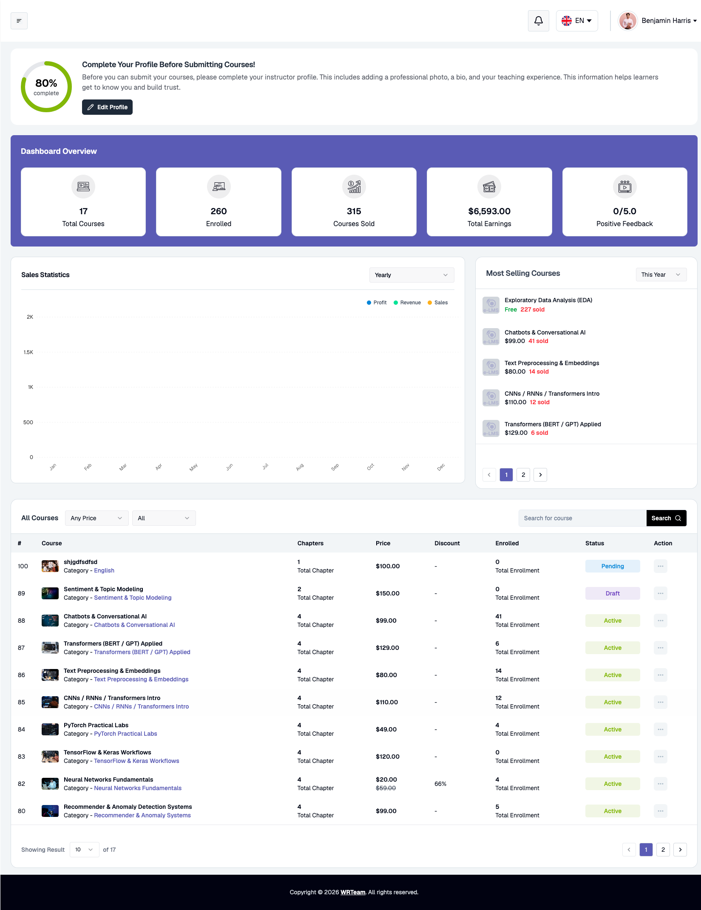

# Dashboard

The Instructor Dashboard provides instructors and team instructors with a complete overview of their courses, earnings, student engagement, and platform activities. It serves as the main control panel for monitoring instructor-related performance and course data.

### Profile Completion

This section displays the instructor's profile completion progress and reminds instructors to complete important profile details — such as profile image, bio, and teaching information — before submitting courses. A quick shortcut to the edit profile page is also available here.

### Dashboard Overview

Displays key account statistics, including: Total Courses, Total Enrollments, Courses Sold, Total Earnings, and Average Feedback Rating received from students.

### Sales Statistics

Provides graphical analytics for course sales, revenue, and profits with filtering options for the current year, month, and week, helping instructors track their business performance and sales trends over time.

### Most Selling Courses

Displays the instructor's top-performing courses based on enrollments and sales, with quick revenue and sales-related insights for each course and a filtering option.

### Courses Listing

Displays all instructor courses in a detailed table with filters and search functionality. Information shown includes course name, chapter count, pricing, discounts, enrollments, and status, along with course management actions.
