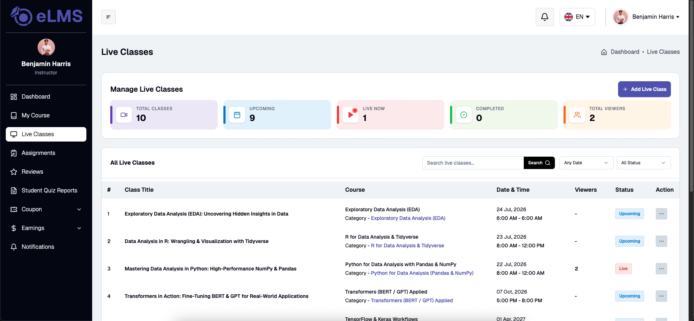
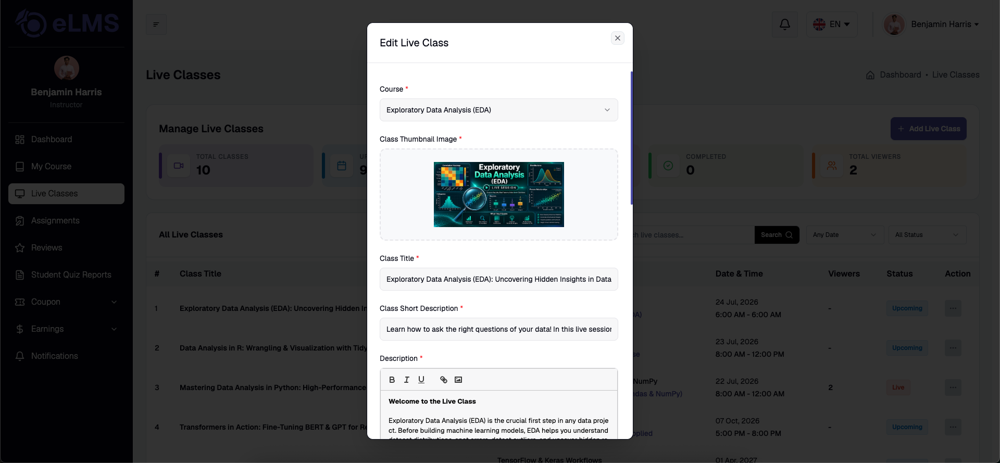

# Live Classes

Instructors can schedule, manage, and conduct interactive live sessions for their enrolled students directly from the instructor web portal using external meeting links.

### Live Classes List

Instructors can view all scheduled, ongoing, and completed live sessions across their courses in a centralized list view. The table displays key details including class title, associated course, scheduled date and time, duration, meeting status, and action options to edit, start, or delete sessions.

### Create / Edit Live Class

Instructors can create a new live class or update existing session details by specifying the class title, course selection, start date and time, duration, and external meeting link (e.g., Zoom, Google Meet, or Microsoft Teams). Additional instructions or meeting notes can also be provided to help enrolled students prepare for the live session.
