# My Courses

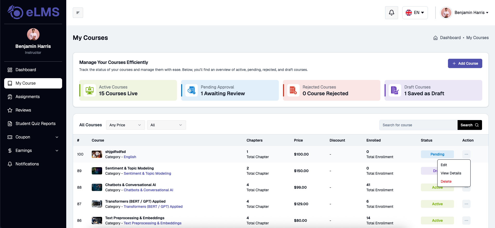

The My Courses page allows instructors and team instructors to manage all their created courses from a single place. It provides course statistics, management actions, and a detailed listing of all courses.

### Course Overview

Displays course counts grouped by their current status: Active, Pending Approval, Rejected, and Draft.

### Course Listing

Displays all instructor courses with details such as course title, category, chapter count, pricing, enrollments, and status. Each course in the listing includes action options to view **Course Details** and **Edit** the course.

---

## Course Creation & Editing

Instructors can create new courses via **Add Course** or modify existing courses via **Edit Course**. Selecting **Edit** opens the pre-populated course form, allowing instructors to update existing details, pricing settings, curriculum structure, and publish settings. The process consists of four main steps:

### Step 1: Create Course

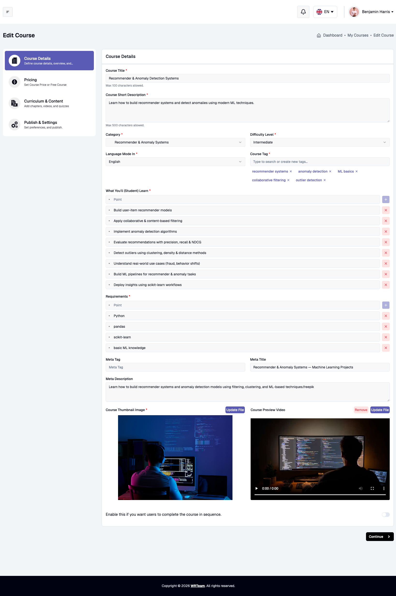

Defines basic course information and metadata:
- **Course Title** (*Required*): Title of the course (Max 100 characters).
- **Course Short Description** (*Required*): Summary overview (Max 500 characters).
- **Category & Sub Category** (*Required*): Subject classification for search and filtering.
- **Difficulty Level** (*Required*): Course level (e.g., Beginner, Intermediate, Advanced).
- **Language Mode In** (*Required*): Primary language of instruction.
- **Course Tag** (*Required*): Search tags (supports selecting or creating new tags).
- **What You'll (Student) Learn** (*Required*): Bullet points of learning outcomes.
- **Requirements** (*Required*): Prerequisites or required tools.
- **Meta Tag, Meta Title, Meta Description**: SEO information for search engine optimization.
- **Course Thumbnail Image & Course Preview Video** (*Required*): Visual assets representing the course.
- **Sequential Completion Toggle**: Option to force sequential video/content progression.
- **Team Course**: Co-instructors can be selected while creating a new course in team mode. If no co-instructors have been added to the team yet, they can also be invited directly from this screen. All co-instructors of a course can manage its details and discussions together.

### Step 2: Pricing

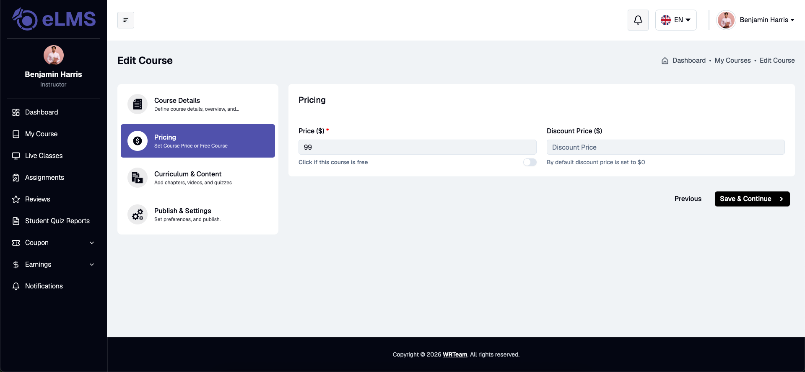

Sets the pricing configuration:
- **Click if this course is free**: Toggle switch to make the course free.
- **Price ($)** (*Required for paid courses*): Standard course price.
- **Discount Price ($)**: Discounted offer price (defaults to $0).

### Step 3: Curriculum & Content

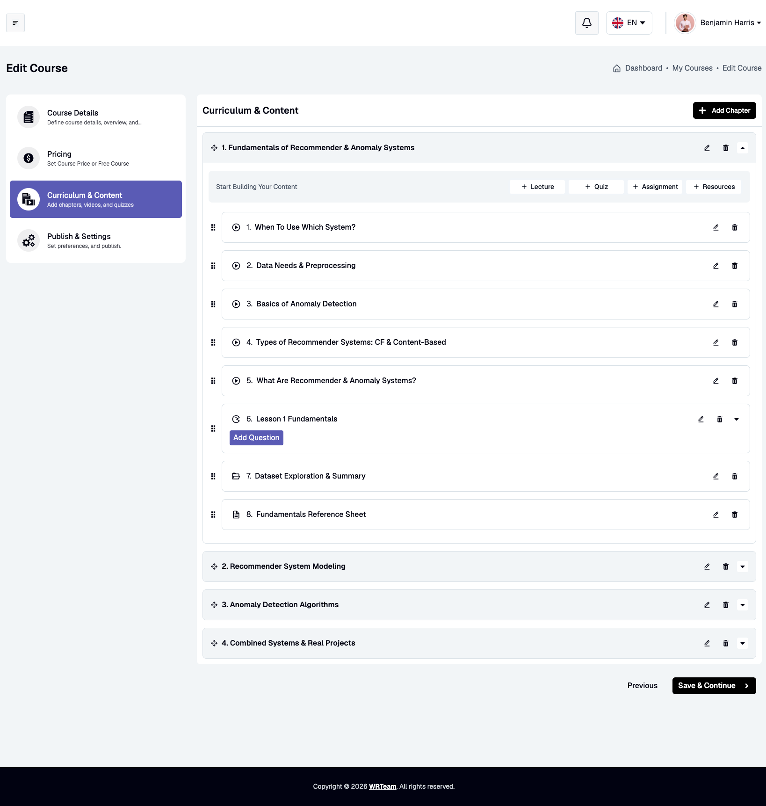

Instructors build and structure course content through step-by-step chapter creation and curriculum item additions:

#### Step 1: Add Chapter

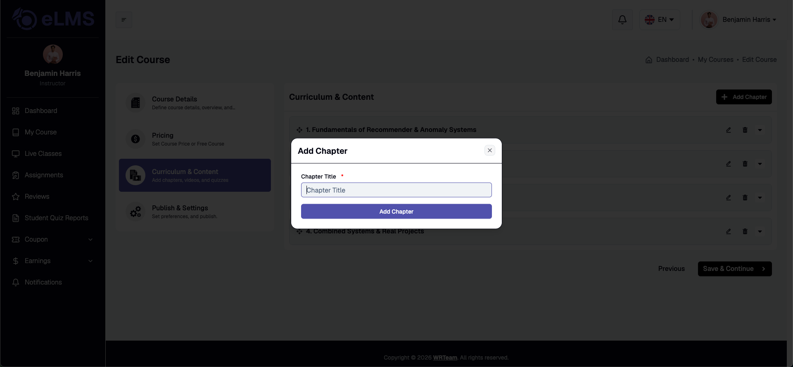

1. Click the **+ Add Chapter** button at the top right of the **Curriculum & Content** tab.
2. Enter the **Chapter Title** (*Required*).
3. Click **Add Chapter** to save the chapter module.
4. (Optional) Reorder chapters using drag-and-drop or expand/collapse modules as needed.

#### Step 2: Add Curriculum Content Items

Within each created chapter, instructors can add four types of curriculum content:

##### 1. Add Lecture

Allows adding video lessons and supporting materials:
1. Under the target chapter, click the **+ Lecture** button.
2. Enter the **Lecture Title** (*Required*).
3. Select the **Lecture Type** (YouTube URL or File Upload).
4. Enter or upload the video source URL / File.
5. (Optional) Toggle **Check this to allow students to preview this lecture** for free preview access before enrollment.
6. (Optional) Click **+ Add Resources** to attach supplementary files (Title, Type, File/URL).
7. Click **Submit Lecture** to save.

##### 2. Add Quiz

Adding a quiz is a two-part step-by-step process:

###### Part 1: Create the Quiz

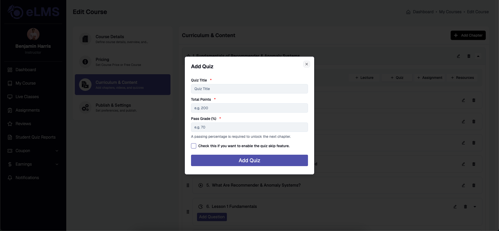

1. Under the target chapter, click the **+ Quiz** button.
2. Enter the **Quiz Title** (*Required*).
3. Set the **Total Points** (*Required*).
4. Enter the **Pass Grade (%)** (*Required*) required to unlock subsequent chapters.
5. (Optional) Enable **Check this if you want to enable the quiz skip feature** to allow students to bypass the quiz.
6. Click **Add Quiz** to create the quiz.

###### Part 2: Add Quiz Questions & Answers

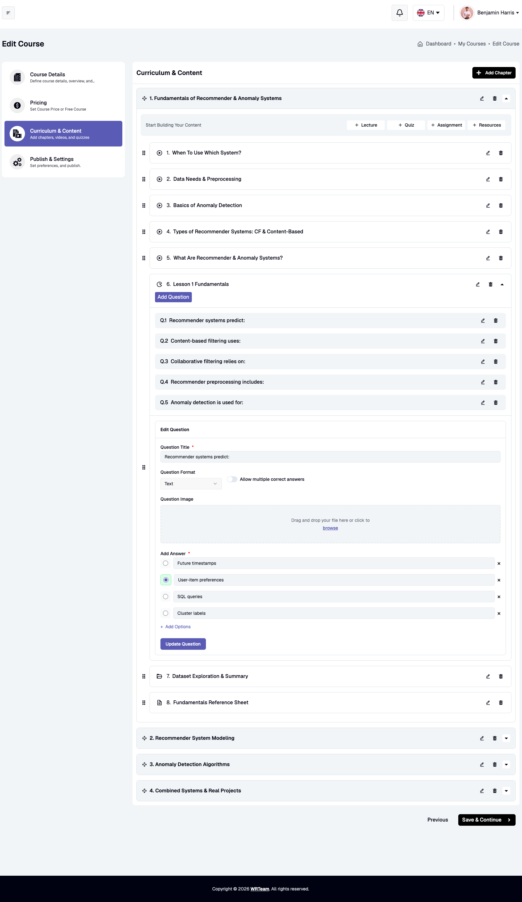

1. Locate the created quiz inside the chapter item list and click **Add Question**.
2. Enter the **Question Title** (*Required*).
3. Select the **Question Format** (e.g., Text).
4. (Optional) Enable **Allow multiple correct answers** if the question has more than one correct choice.
5. (Optional) Upload a **Question Image** by dragging and dropping or browsing your files.
6. Under **Add Answer**, enter the option choices. Click **+ Add Options** to add more answer choices.
7. Select the radio button next to the correct answer choice.
8. Click **Update Question** to save the question. Repeat this step for each question in the quiz.

##### 3. Add Assignment

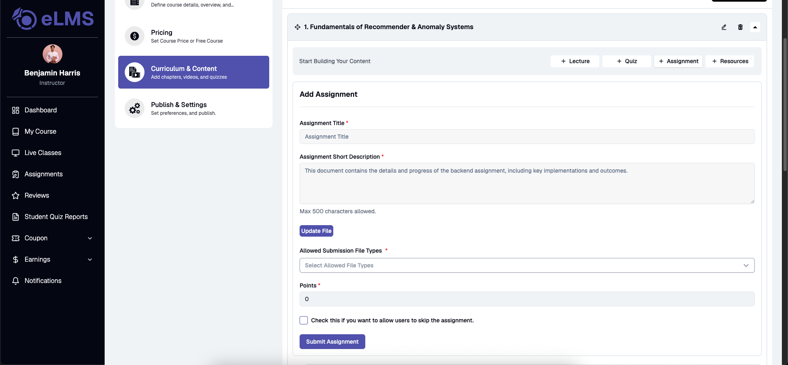

Allows creating practical assignments for student submission:
1. Under the target chapter, click the **+ Assignment** button.
2. Enter the **Assignment Title** (*Required*).
3. Enter the **Assignment Short Description** (*Required*) with task instructions (Max 500 characters).
4. (Optional) Click **Upload File** to attach guidelines or project files.
5. Select the **Allowed Submission File Types** (*Required*, e.g., Image, Video, Audio, Document).
6. Set the **Points** (*Required*) allocated for the assignment.
7. (Optional) Enable **Check this if you want to allow users to skip the assignment**.
8. Click **Submit Assignment** to save.

##### 4. Add Resources

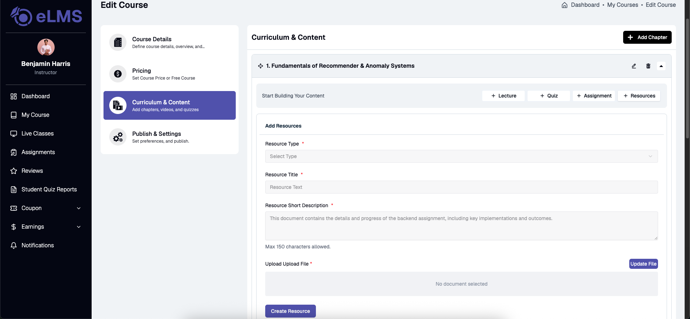

Allows attaching standalone study materials to the chapter:
1. Under the target chapter, click the **+ Resources** button.
2. Select the **Resource Type** (*Required*, e.g., Image, Audio, Video, External URL, Document).
3. Enter the **Resource Title** (*Required*).
4. Enter the **Resource Short Description** (*Required*) (Max 150 characters).
5. Upload the file or enter the external reference link (**Upload File / URL**) (*Required*).
6. Click **Create Resource** to save.

### Step 4: Publish & Settings

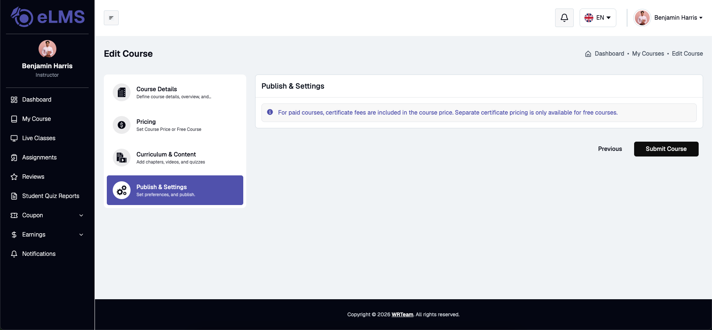

Configures publishing rules and certificates:
- **Certificate Settings**: For paid courses, certificate fees are included in the course price. For free courses, certificate pricing can be configured separately with an unlock amount option.
- **Submit Course**: Submits the course to admin panel for review and publication.

---

### Step 5: Course Review

Each newly submitted course is sent to the admin for approval and appears under Course Publish Requests in the admin panel, where it can be approved or declined.

## Course Details Tabs

Clicking **View Details** on any course opens the Course Details page with seven dedicated management tabs:

### 1. Course Statistics

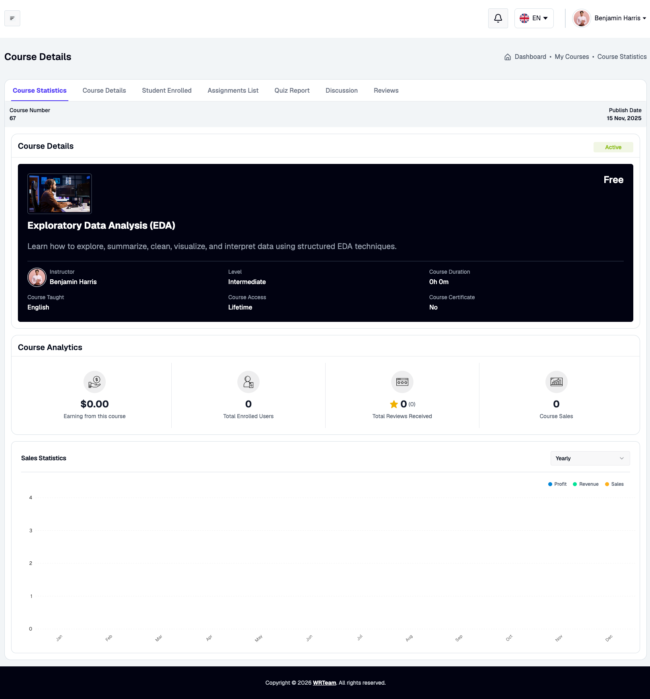

The **Course Statistics** tab provides a complete analytical dashboard for the selected course:
- **Course Details Header**: Displays course thumbnail, title, short description, instructor name, difficulty level, course duration, language taught, access type (e.g., Lifetime), certificate availability, course number, publish date, and active/inactive status.
- **Course Analytics Cards**:
  - **Earnings from this course**: Total revenue generated from the course.
  - **Total Enrolled Users**: Number of students enrolled.
  - **Total Reviews Received**: Average rating score and total review count.
  - **Course Sales**: Total number of sales transactions.
- **Sales Statistics Chart**: Graphical analytics for Profit, Revenue, and Sales with time filter options (Yearly, Monthly, Weekly).

### 2. Course Details

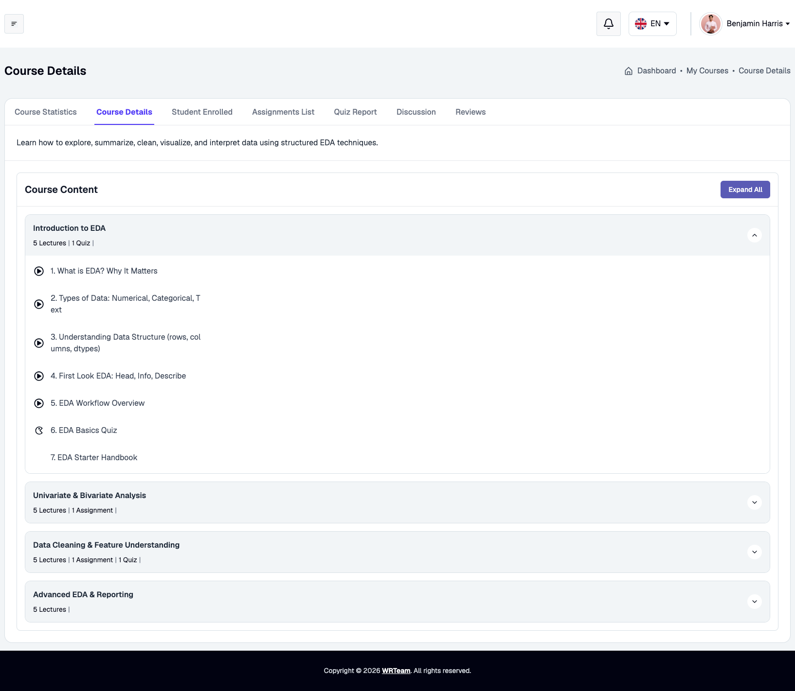

The **Course Details** tab displays the complete course overview and content structure:
- **Course Description**: Detailed explanation of course goals and covered topics.
- **Course Content Tree**: Expandable chapter sections showing lecture counts, quiz counts, assignment counts, resource attachments, and specific topic lists. An **Expand All** button allows viewing all content sections simultaneously.

### 3. Student Enrolled

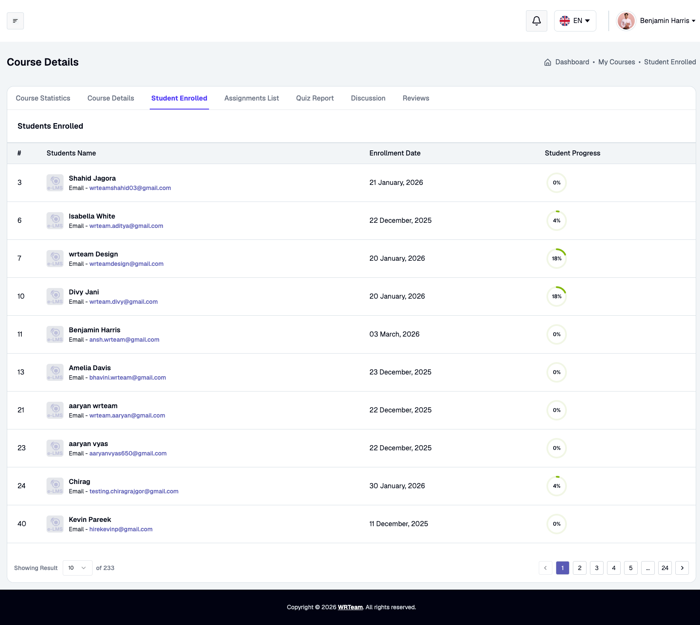

The **Student Enrolled** tab lists all students currently registered for the course:
- **#**: Index or ID.
- **Students Name & Email**: Student full name and account email address.
- **Enrollment Date**: Date when the student registered for the course.
- **Student Progress**: Visual percentage completion indicator showing student course progress.

### 4. Assignments List

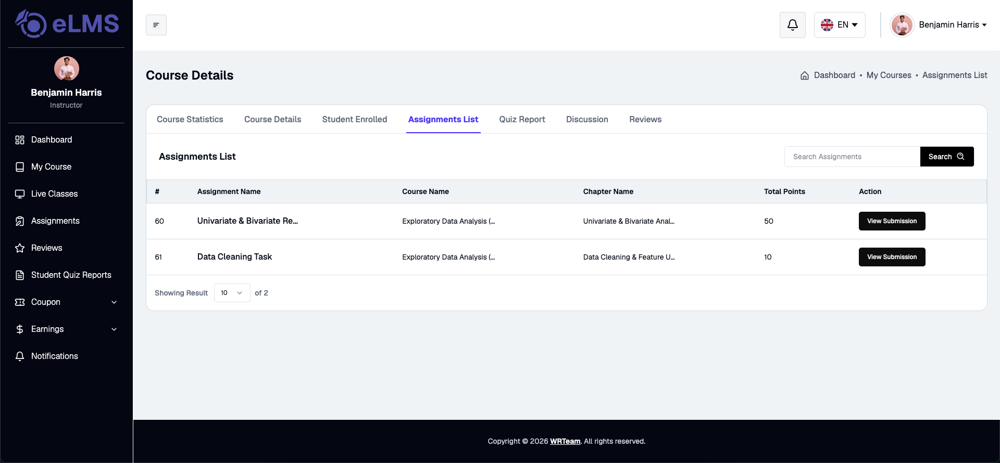

The **Assignments List** tab provides tracking for all course assignments:
- **Assignment Name**: Title of the assignment task.
- **Course Name & Chapter Name**: Associated course title and chapter section.
- **Total Points**: Maximum marks assigned for the task.
- **Action (View Submission)**: Button to view all student submissions, grade responses, and provide notes.

### 5. Quiz Report

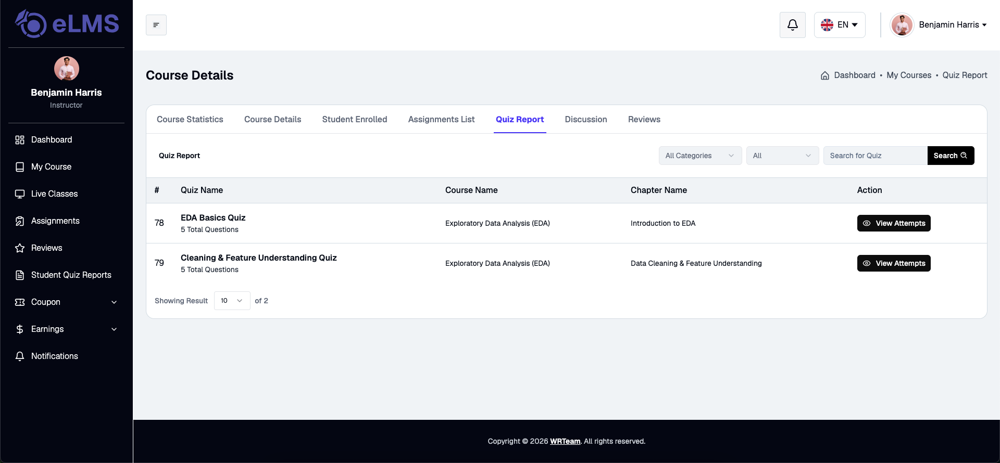

The **Quiz Report** tab lists all quizzes within the course along with category and search filters:
- **Quiz Name & Questions**: Quiz title and total question count.
- **Course Name & Chapter Name**: Chapter section where the quiz is located.
- **Action (View Attempts)**: Button to open detailed student performance and attempt records.

#### Quiz Report Details

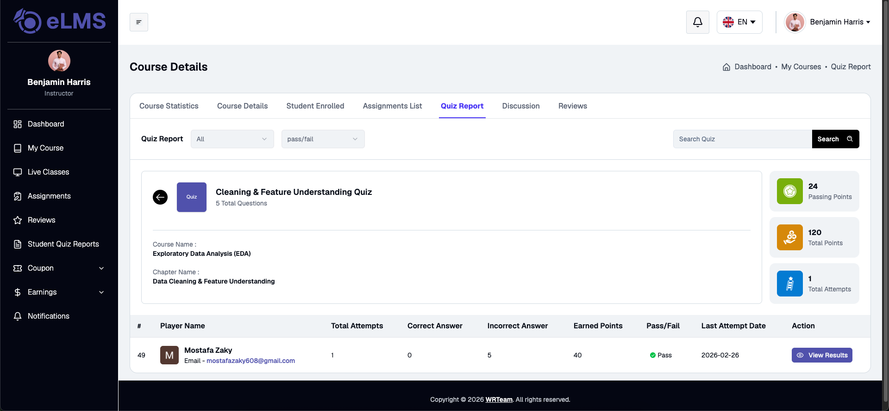

Inside **View Attempts**, instructors can inspect comprehensive attempt metrics:
- **Summary Metrics**: Displays Passing Points threshold, Total Points available, and Total Attempts count.
- **Student Performance Table**:
  - **Player Name & Email**: Student details.
  - **Total Attempts**: Number of attempt tries made by the student.
  - **Correct Answer & Incorrect Answer**: Counts of correct and wrong responses.
  - **Earned Points**: Total marks obtained.
  - **Pass/Fail Status**: Badge indicating whether the student met the pass grade.
  - **Last Attempt Date**: Date and time of the latest attempt.
  - **Action (View Results)**: Option to review individual question answers.

### 6. Discussion

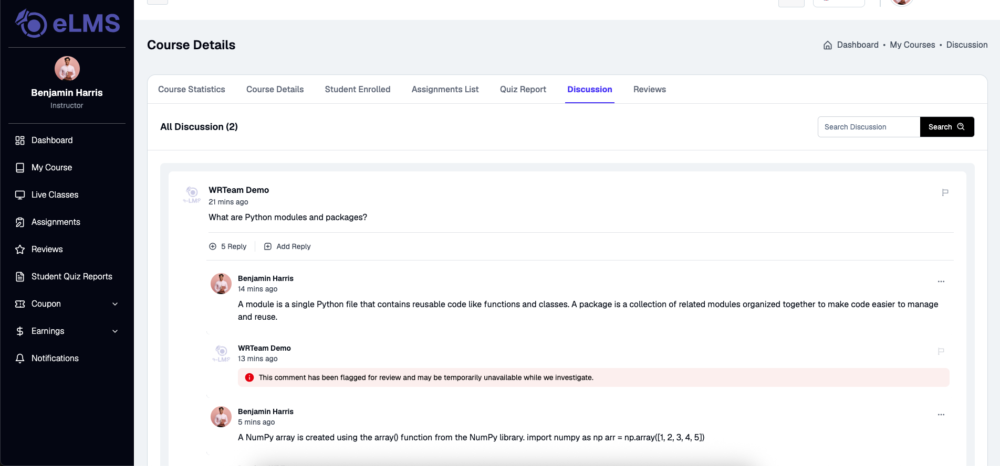

The **Discussion** tab serves as the main Q&A thread management center:
- **Discussion Posts**: Student questions and discussion topics.
- **Replies**: Interactive thread replies from instructors and co-instructors.
- **Moderation Tools**: Action buttons to add replies or flag inappropriate comments.

### 7. Reviews

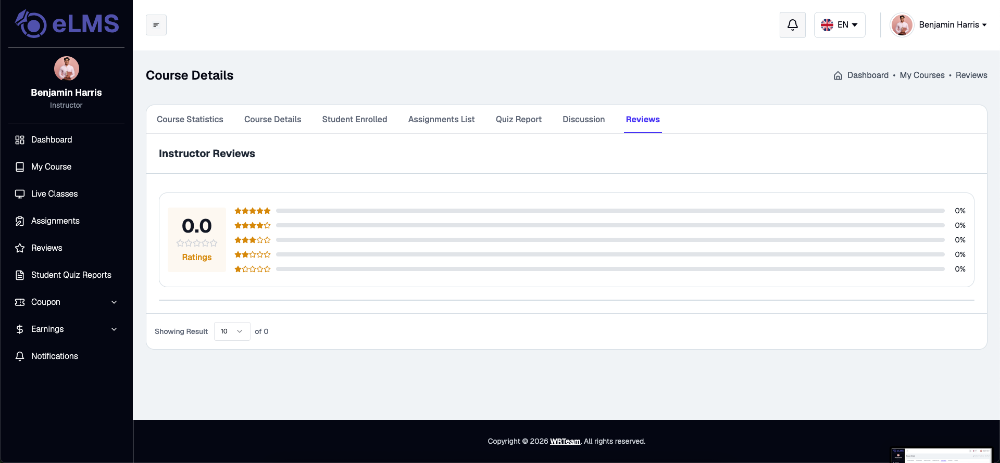

The **Reviews** tab presents student ratings and reviews:
- **Average Rating**: Overall star rating average (0.0 to 5.0).
- **Rating Distribution**: Percentage breakdown for 5-star through 1-star ratings.
- **Reviews List**: Individual student review messages and star ratings.

---

