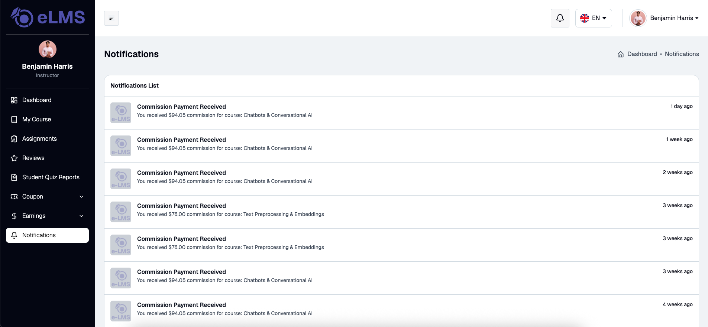

# Notifications

Displays the full list of notifications for the instructor's account in a table. Each notification entry includes the notification title, a short description or message, and the timestamp of when it was received. Notifications cover platform activities relevant to the instructor, such as new student enrollments, assignment submissions, refund requests, course approval or rejection updates, and review submissions. The list is ordered with the most recent notifications at the top.
