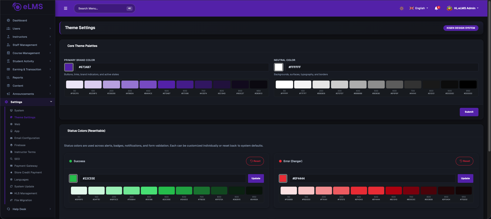
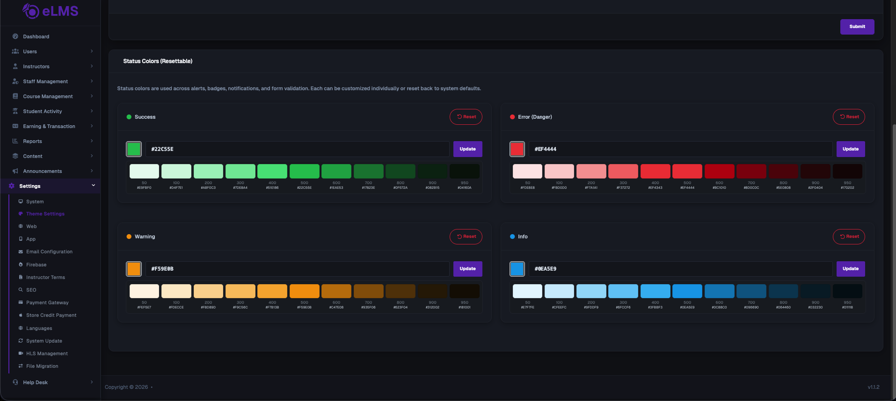

# Change App Theme

This guide explains how the app theme (colors) works in the ELMS application.

## Overview

The app's color theme is no longer fixed in the code. It is now **dynamic** — the colors you see in the app (buttons, backgrounds, highlights, etc.) are controlled from the **Admin Panel**.

Whatever color the Admin sets in the Admin Panel's theme settings is automatically applied inside the app, for both light mode and dark mode.

## How to Change the App Theme Color

1. Log in to the **Admin Panel**.
2. From the left sidebar, go to **Settings → Theme Settings**.
3. Under **Core Theme Palettes**, set the **Primary Brand Color** (and **Neutral Color** if needed), then click **Submit**.

   

4. Below that, under **Status Colors (Resettable)**, you can also customize the **Success**, **Error**, **Warning**, and **Info** colors individually. Click **Update** next to each one to save it, or **Reset** to go back to the default.

   

The app will automatically pick up the new colors — no app update or rebuild is required.

## How It Works (In Simple Terms)

- The Admin sets the theme color from the Admin Panel.
- The app checks for the latest theme color whenever it starts.
- If the color has been changed by the Admin, the app automatically updates itself with the new color.
- If nothing has changed, the app simply uses the color it already has saved, so it doesn't need to check every single time.

## Fallback (Default) Color

The app also has a **fallback color** built into it. This is the color the app shows before it has received any color from the Admin Panel (for example, the very first time the app opens, or if it's unable to connect to get the latest settings).

- This fallback color is set inside the app's code by the developer, not from the Admin Panel.
- It is only a starting/default color — once the app successfully gets the color from the Admin Panel, that color takes over.
- If you want to change this default/fallback color (for example, when setting up a new app before the Admin Panel is configured), it can be updated in the file:
  ```
  lib/core/theme/kigen/kigen_primitives.dart
  ```
  In this file, you'll find the default color values. Simply replace the color code with the one you want to use as the new default.

**Note:** Changing this file only changes the *default* color shown before the Admin Panel's color loads. It does not override a color that the Admin has already set.

## Testing the Theme Change

1. Change the color from the Admin Panel.
2. Close and reopen the app.
3. Check that the new color appears correctly in both light mode and dark mode.
4. Check buttons, cards, and other screens to make sure the color looks consistent everywhere.

## Troubleshooting

**Q: The color didn't change after updating it in the Admin Panel**
- Make sure the change was saved properly in the Admin Panel.
- Close the app completely and reopen it (a simple screen refresh may not be enough).

**Q: The color looks different in dark mode**
- This is expected — dark mode uses a slightly different shade of the same color for better visibility.

**Q: Some parts of the app still show the old color**
- Try fully closing and restarting the app.
- If the issue continues, contact the development team, as a few areas may need to be updated separately.

---
