# Integrate with Firebase

There are two ways to connect your Flutter app to Firebase: manually through the Firebase Console, or using the **FlutterFire CLI**. The ELMS app itself is configured using the FlutterFire CLI (it generates `firebase.json` and `lib/firebase_options.dart`, which are used in `main.dart` via `Firebase.initializeApp(options: DefaultFirebaseOptions.currentPlatform)`), so that approach is recommended.

## Option A: FlutterFire CLI (Recommended)

### 1. Install the Firebase CLI and log in

**Prerequisite:** Node.js (and npm) must be installed on your machine, since the Firebase CLI is distributed as an npm package. Download it from [nodejs.org](https://nodejs.org/) (LTS version recommended) and verify the installation:

```bash
node -v
npm -v
```

Once Node.js is installed, install the Firebase CLI and log in:

```bash
npm install -g firebase-tools
firebase login
```

### 2. Install the FlutterFire CLI

```bash
dart pub global activate flutterfire_cli
```

### 3. Run `flutterfire configure` from your project root

```bash
flutterfire configure
```

This will:
- Let you select (or create) a Firebase project
- Let you select the platforms to configure (Android, iOS, etc.)
- Automatically download and place `google-services.json` in `android/app/` and `GoogleService-Info.plist` in `ios/Runner/`
- Generate `lib/firebase_options.dart` and a `firebase.json` manifest at the project root

### 4. Initialize Firebase in `main.dart`

```dart
import 'package:firebase_core/firebase_core.dart';
import 'package:elms/firebase_options.dart';

await Firebase.initializeApp(options: DefaultFirebaseOptions.currentPlatform);
```

### 5. Configure iOS notifications

[https://firebase.flutter.dev/docs/messaging/apple-integration](https://firebase.flutter.dev/docs/messaging/apple-integration)

**Note:** If you later add, remove, or rename an app in the Firebase Console, re-run `flutterfire configure` to regenerate `firebase_options.dart` and the platform config files instead of editing them by hand.

---

## Option B: Manual Setup (Firebase Console)

### 1. Create Firebase project in your account

   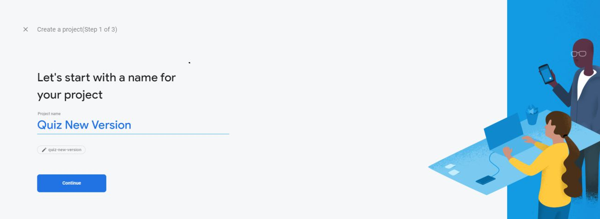
   
   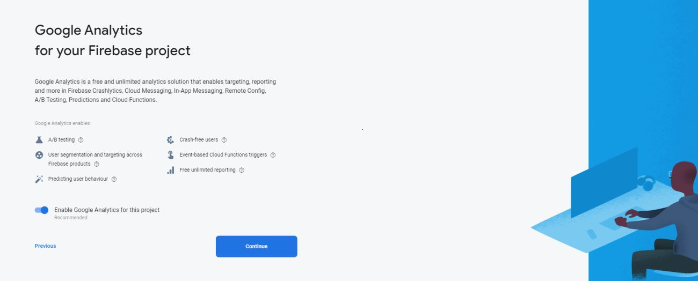
   
   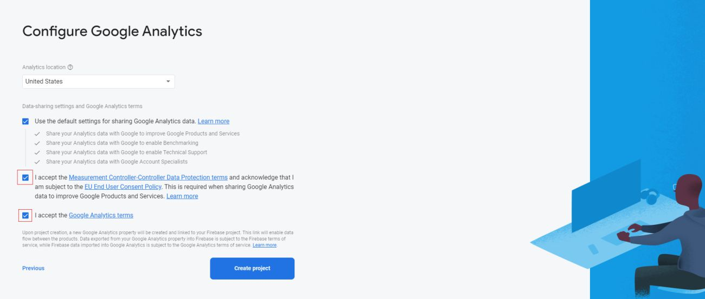
   
   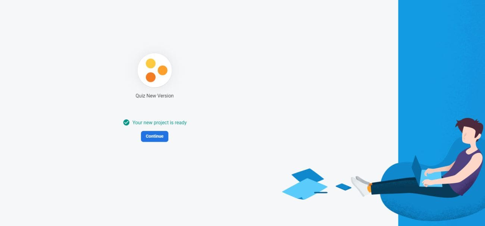

### 2. Add android application to your Firebase project

   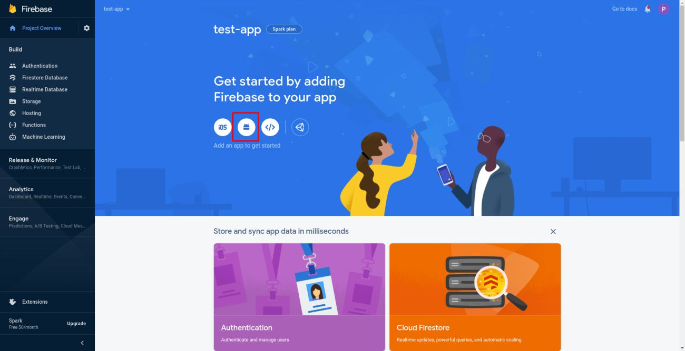
   
   **Download the google-service.json file and add in this folder android/app/**
   
   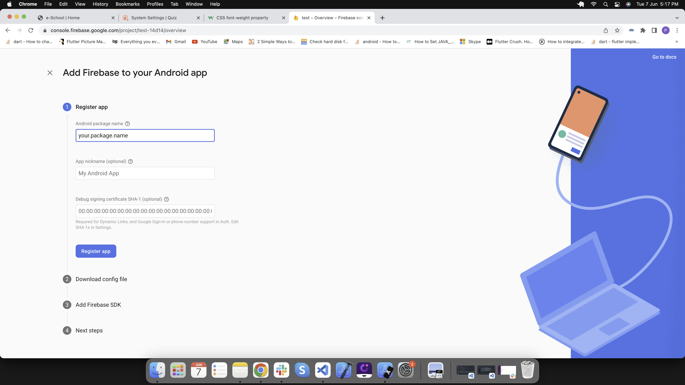
   
   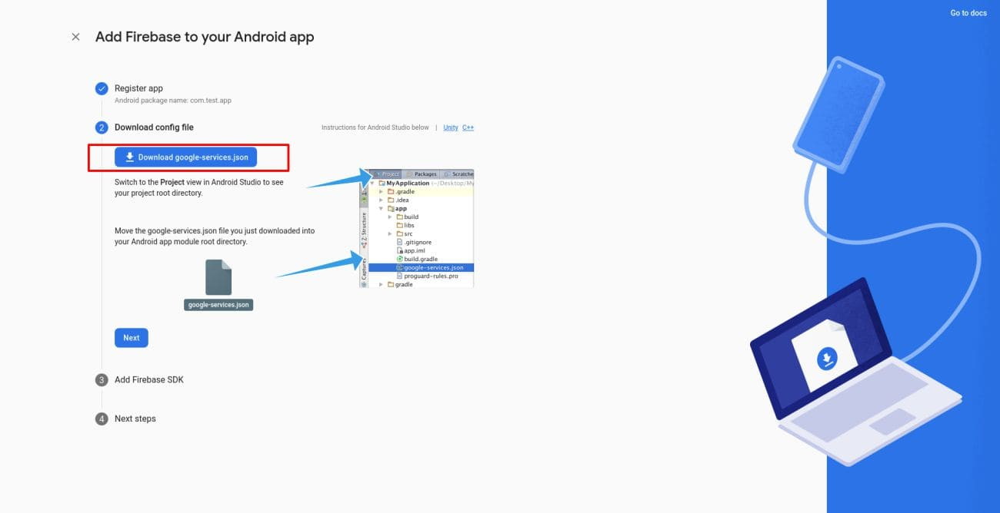
   
   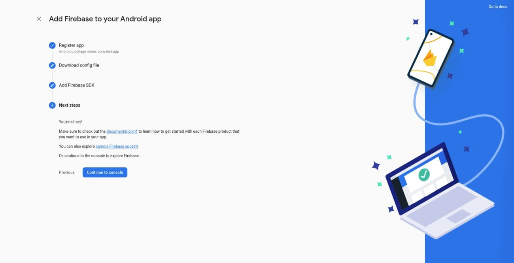

### 3. Add ios application to your Firebase project

   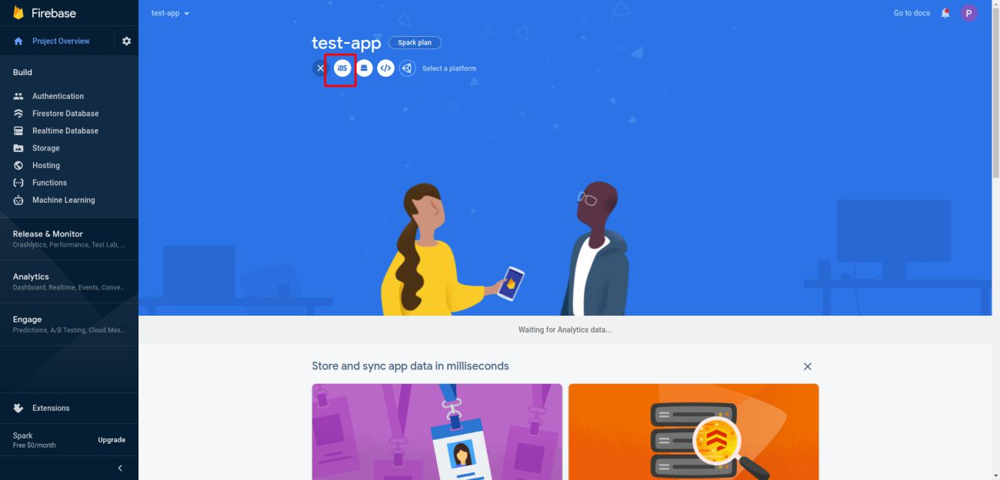
   
   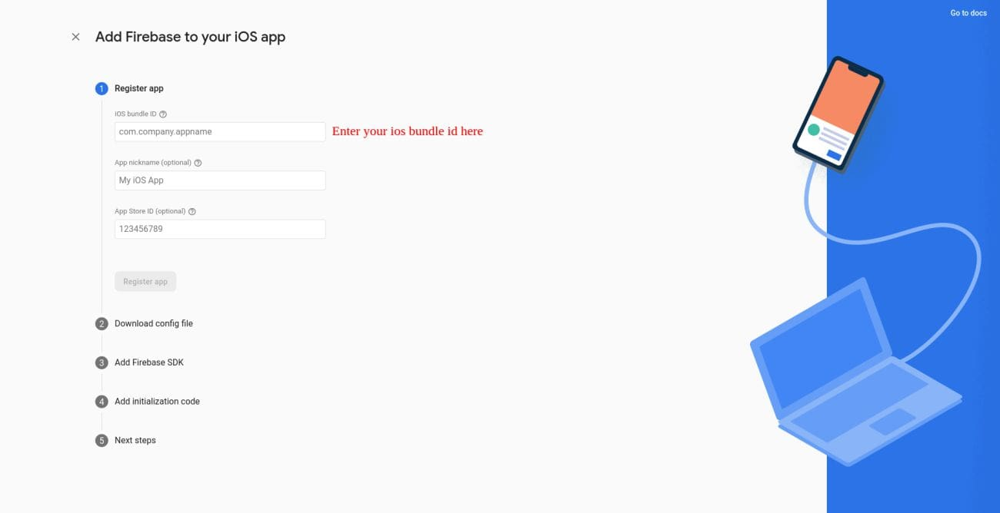

### 4. Download GoogleService-Info.plist and add in this folder ios/Runner/

   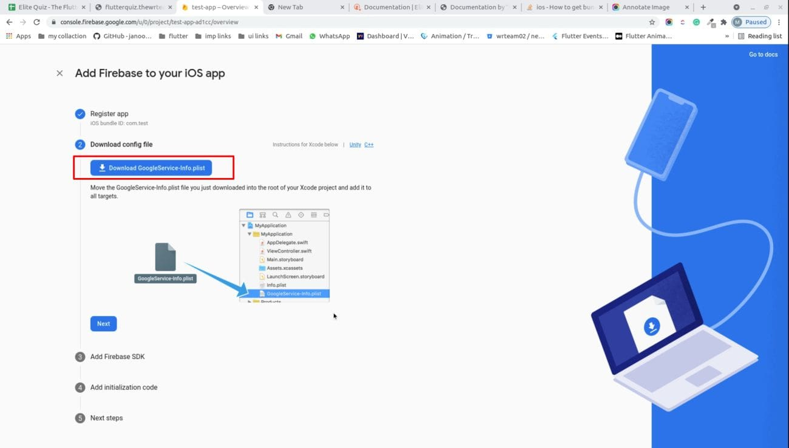

### 5. Please configure this settings in-order to send ios notifications.

   [https://firebase.flutter.dev/docs/messaging/apple-integration](https://firebase.flutter.dev/docs/messaging/apple-integration)

### 6. You have configured Firebase in your project successfully

---
Additional Resources:
For detailed Firebase setup and configuration: [Firebase Setup Guide](https://www.marketplace.wrteam.in/docs/flutter-common-doc/GeneralSettings/firebase/)