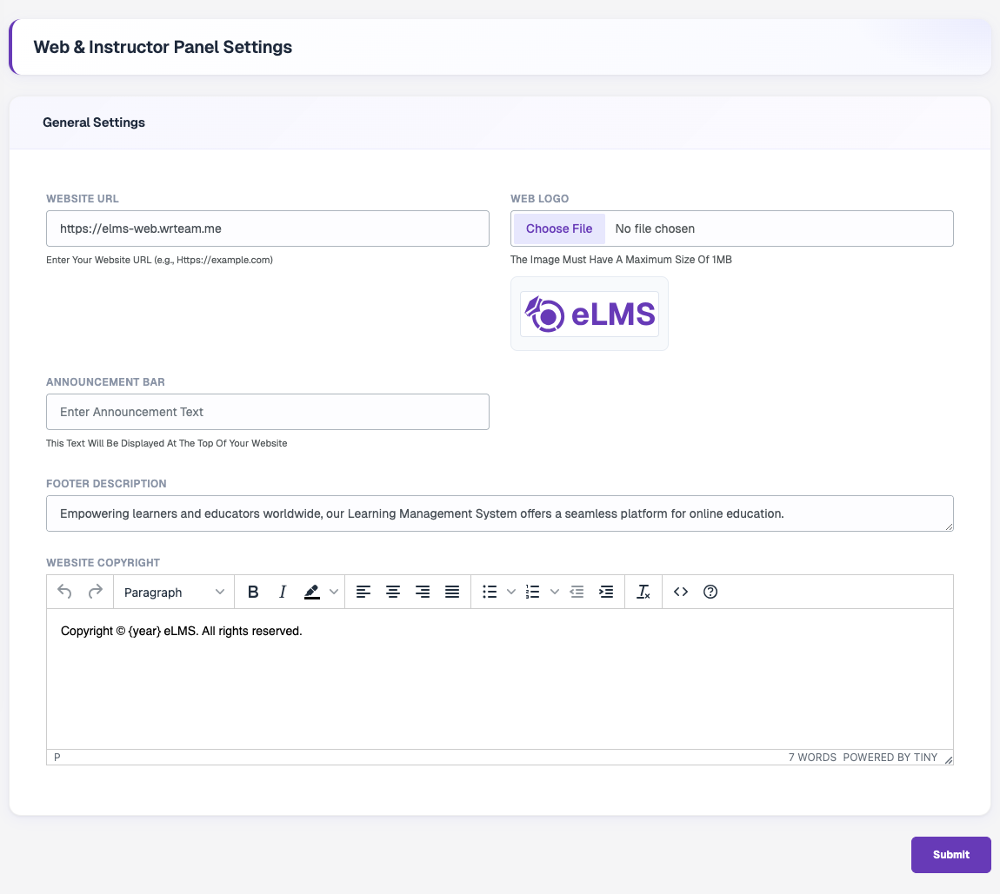
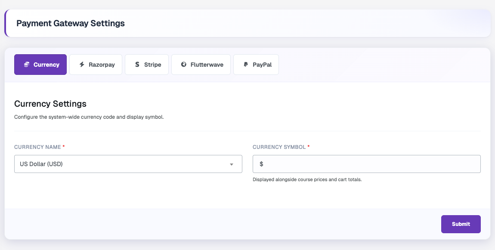

# Basic Settings

Most basic settings of your Web application are managed from the admin panel. This page shows where to find each one.

| What you want to change | Where to find it |
| --- | --- |
| App name, maintenance mode, timezone, schema | **Settings → System → General** |
| Favicon, vertical logo, login banner, placeholder image | **Settings → System → Branding** |
| Contact details | **Settings → System → Contact** |
| Social media links and icons | **Settings → System → Social Media** |
| Web logo, website URL, announcement bar, footer description, copyright | **Settings → Web** |
| Theme color | **Settings → Theme Settings** |
| System currency | **Settings → Payment Gateway → Currency** |

## Change App Name

1. Go to admin panel **Settings → System → General**
2. Update **Platform Name** and click **Submit**.

Other settings on this tab: **Schema**, **Maximum Video Upload Size**, **Timezone**, **Weekly Average Watch Hours** and **Maintenance Mode**. See [Toggle Maintenance Mode](./toggle-maintenance-mode.md) for details.

## Set Favicon Icon

A favicon is a small icon that appears in browser tabs and bookmarks for your website.

1. You can generate favicon icons from this site: [Favicon Generator](https://www.favicon-generator.org/)
2. Go to admin panel **Settings → System → Branding**
3. Upload your icon in **Favicon** (maximum size 1MB) and click **Submit**.

## Change Logo, Footer Description and Announcement Bar

1. Go to admin panel **Settings → Web**
2. Upload your **Web Logo** (maximum size 1MB).
3. Update **Website URL**, **Announcement Bar**, **Footer Description** and **Website Copyright** as needed.
4. Click **Submit**.

## Change Theme Color

1. Go to admin panel **Settings → Theme Settings**
2. Change the **Primary Brand Color** and **Neutral Color**, then click **Submit**.
3. Status colors (Success, Error, Warning and Info) can be updated or reset individually.

## Change System Currency

1. Go to admin panel **Settings → Payment Gateway → Currency**
2. Select the currency and click **Submit**.

## Change Contact Details

1. Go to admin panel **Settings → System → Contact**
2. Update the address, email and phone number and click **Submit**.

## Add Social Media Link and its Icon

1. Go to admin panel **Settings → System → Social Media**
2. Click **Add New Social Media**, then add the icon, platform name and destination URL.
3. Click **Submit**.

